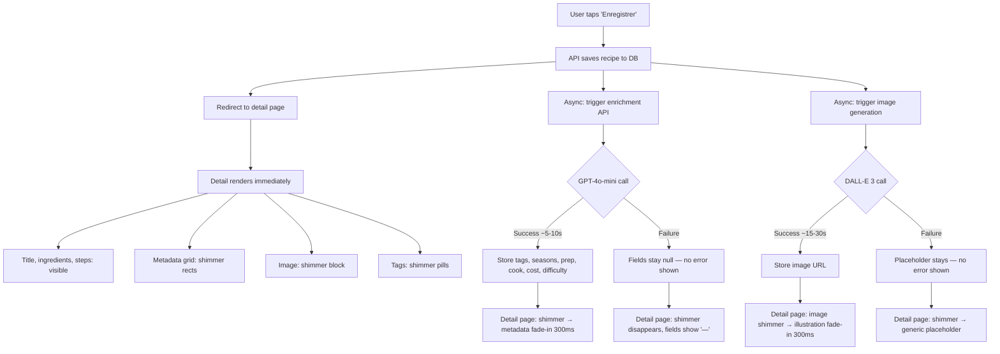
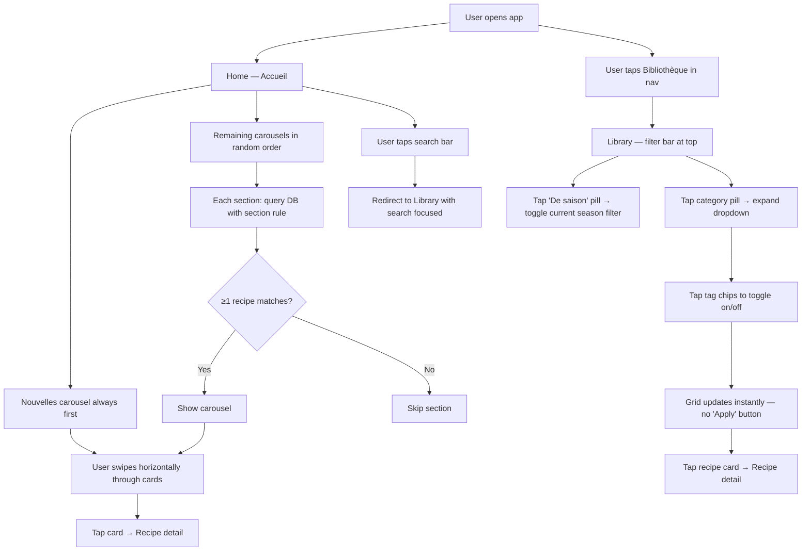
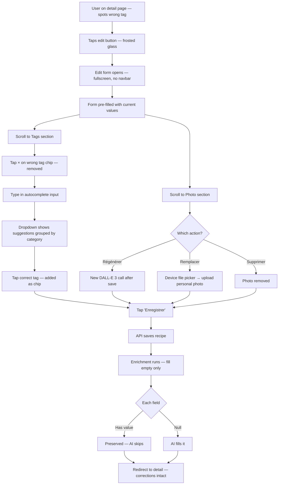
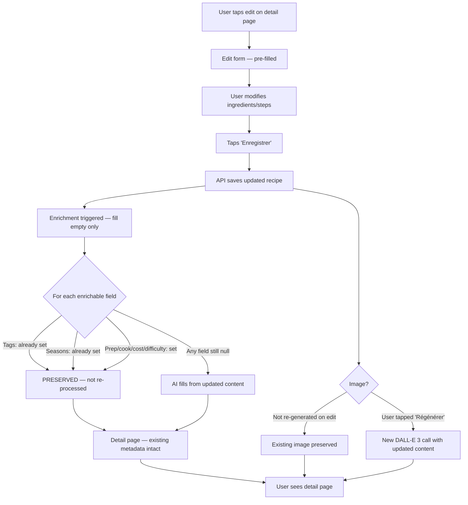

# UX Design Specification — atable v3.0 (AI Enrichment)

**Author:** Anthony
**Date:** 2026-03-12

---

<!-- UX design content will be appended sequentially through collaborative workflow steps -->

## Executive Summary

### Project Vision

atable v3 adds an intelligence layer to the existing personal recipe library. V1 delivered the core recipe vault — capture, browse, search. V2 added household identity with session auth. V3 shifts the organizational burden from the user to the system: a single GPT-4o-mini call per recipe automatically extracts tags, seasons, prep/cook time, cost, and complexity — plus generates a DALL-E 3 flat-illustration image.

The driving UX problem: v1 carousels depend on manual tags that users never bother to assign. Home screen discovery suffers. V3 fixes this structurally — every recipe gets rich metadata without user effort. The library becomes more browsable and visually consistent with every recipe added.

The UX challenge is layered: integrate AI-generated metadata into an existing warm, minimal design without adding clutter; make the async enrichment feel instant and delightful rather than laggy; design a tag editing experience that works well on mobile despite a 50+ tag taxonomy; and solve the home screen curation problem — with rich metadata on every recipe, the home needs to surface what's relevant without overwhelming the user.

### Target Users

**Anthony (Household Creator)** — Existing user, cooks intentionally, saves recipes from memory or adaptation. Primary device: iPhone (kitchen use), iPad (weekend planning). Expects zero friction — the app should organize recipes for him, not ask him to organize them. Technically comfortable but has no patience for metadata forms.

**Marie (Household Curator)** — Browses and plans the weekly meals. Values discovery — wants to find the right recipe for tonight in under a minute. Uses the "De saison" toggle, browses carousels, filters by time. Expects a visually cohesive library that feels curated despite zero manual effort.

**Demo Visitors** — Friends and curious visitors testing via the shared demo household. Need to experience the full v3 feature set (AI enrichment, images, tags, seasons) to understand the product's value. Their modifications are sandboxed and reset every 24h.

### Key Design Challenges

1. **Enrichment loading choreography** — Two async processes with different timings (enrichment ~5-10s, image generation ~15-30s) must feel seamless. The recipe detail page must be fully readable during enrichment, with metadata slots shimmering and resolving progressively. The transition from "loading" to "populated" is the product's signature moment — it must feel delightful, not jarring.

2. **Tag editing on mobile** — 50+ predefined tags across 6 categories, plus custom tag creation, in a touch-first interface. The autocompletion grouped by category needs to be fast and scannable without feeling like a nested dropdown. Remove/add must be tap-tap-done.

3. **Metadata density management** — Tags, seasons, prep time, cook time, cost, complexity, and a generated image are all new to the recipe detail page. The existing minimal aesthetic (warm white, olive accent, generous spacing) must absorb this information without becoming cluttered. Information hierarchy is critical — what's glanceable vs. what's expandable.

4. **Home screen curation & tag filtering** — With 50+ tags, the home screen can't display a carousel for each. Which tags earn a carousel? How does the selection stay relevant as the library grows? And when the user wants to filter by tag in the library, how do they navigate 6 categories × ~10 tags without it feeling like a database query? The home needs to balance discovery (browsing inspiration) with precision (finding "all Végétarien + Rapide" recipes). This also intersects with the "De saison" toggle and time/cost filters — the filtering model must feel unified, not a patchwork of independent controls.

### Design Opportunities

1. **Zero-effort delight** — The first auto-enrichment is the product's "wow" moment. Shimmer → tags appear → image materializes. This interaction is worth investing in — it's what users will show their friends.

2. **Alive carousels** — AI-populated tags transform the home screen from sparse to rich. Tag-driven carousels ("Rapide," "Comfort food," "De saison") with consistent card imagery create a browsing experience that feels curated without any manual work.

3. **Cohesive visual library** — The flat-illustration style gives every recipe a card image in a unified aesthetic. Mixed with user photos, the library grid feels warm and intentional — a significant upgrade over the placeholder-heavy v1 grid.

## Core User Experience

### Defining Experience

The core user action remains unchanged from v1: **save a recipe, then find it later**. V3 transforms the "find it later" half by making every recipe self-organizing through AI enrichment.

V3's defining interaction is a two-part loop:
1. **Save → Enrich** — The user saves a recipe. Within seconds, metadata and an illustration appear without any user action. The recipe organized itself.
2. **Browse → Pick** — The user opens the app to find something to cook. Between curated home carousels and precise library filters, the right recipe surfaces in under a minute.

### Platform Strategy

- **Primary surface:** iPhone (Safari PWA, standalone mode). Touch-first, one-handed use in the kitchen.
- **Secondary surface:** iPad (Safari). Sunday meal planning — more screen real estate for browsing.
- **Tertiary:** Desktop browser (macOS Safari/Chrome). Occasional use for recipe entry.
- **PWA:** Manifest enables "Add to Home Screen" with standalone display. No service worker / offline for v3.
- **Responsive model:** Unchanged from v2 — mobile-first, single breakpoint at `lg` (1024px). Bottom nav on mobile, side rail on desktop.

### Effortless Interactions

| Interaction | Effortless standard |
|---|---|
| **Saving a recipe** | Identical to v1. Zero new fields, zero new friction. Enrichment is invisible background work — the user never waits for AI. |
| **Browsing by mood** | Home carousels are pre-curated. Swipe → tap → done. No filter configuration needed. |
| **Filtering with precision** | Library filter bar: tap a category → tap a tag → results update instantly. Combinable filters (tag + season + time). |
| **Overriding AI suggestions** | Inline on the recipe detail/edit view. Tap a tag chip to remove it, type to add. No separate "correction mode." |
| **Image re-generation** | One button, one tap. New image appears after shimmer. No prompt editing. |

### Critical Success Moments

1. **First enrichment reveal** — User saves their first recipe in v3. The detail page shimmers, then tags, seasons, time, cost, and a flat illustration all appear. This is the "the app is smart" moment. If this feels broken, slow, or inaccurate, trust is lost immediately.

2. **First meaningful carousel browse** — User opens the home screen and carousels are populated with relevant, well-tagged recipes. "Rapide" has 6 recipes, "Comfort food" has 4, "De saison" shows winter dishes in January. The home feels alive for the first time.

3. **First successful filter** — User opens the library, taps "Végétarien" + "Rapide", and gets exactly the right results. The filtering model is intuitive — no learning curve.

4. **First AI correction** — User spots a wrong tag ("Indienne" instead of "Libanaise / Orientale"). They remove it and add the right one in 3 taps. The correction is trivial — confidence in the system is maintained because overriding is easy.

### Experience Principles

| Principle | Meaning |
|---|---|
| **Home discovers, Library filters** | Home screen = curated carousels for inspiration and serendipity. Library = filter bar for "I know what I want." Two screens, two jobs, one tag system underneath. |
| **AI suggests, user decides** | Every AI-assigned field is visually overridable. The system never locks metadata. Corrections are always faster than manual entry from scratch. |
| **Save is sacred** | Recipe capture friction must never increase. V3 adds zero fields to the save form. Enrichment happens after, invisibly. |
| **Progressive revelation** | Metadata appears as it arrives — shimmer → resolve. The page is always usable, never blocked. Two timings (enrichment ~5-10s, image ~15-30s) resolve independently. |
| **Warm, not clinical** | The app organizes recipes like a thoughtful person would, not like a database. Carousels feel curated, not computed. Filters feel like browsing a bookshelf, not querying a spreadsheet. |

## Desired Emotional Response

### Primary Emotional Goals

**"My kitchen has a curator."** — The app feels like someone thoughtfully organized your recipes for you. Not a robot, not a database — a person who knows what's in season, what's quick, what's comfort food. The intelligence layer should feel warm and personal, not algorithmic.

### Emotional Journey Mapping

| Moment | Desired feeling | What creates it |
|---|---|---|
| **Saving a recipe** | Relief + satisfaction | "Done. It's captured." Same instant save as v1. No extra work. |
| **Enrichment reveal** | Surprise + delight | "Wait, it tagged it AND drew a picture?" The shimmer → resolve is the magic trick. |
| **Browsing home carousels** | Inspiration + warmth | "Oh, that one looks good for tonight." Curated, visual, seasonal. Feels like flipping through a beautiful cookbook. |
| **Filtering in library** | Confidence + efficiency | "I know exactly how to find what I need." Tap-tap, results appear. No friction. |
| **Correcting AI** | Control + ease | "It got it almost right, and fixing it was trivial." Not frustration — just a quick tweak. |
| **Something fails** | Calm + trust | "The recipe is still there. The AI stuff will come." Enrichment failure is invisible — nothing breaks. |

### Micro-Emotions

**To cultivate:**
- **Trust** — AI accuracy >80% so the delight moment doesn't become an annoyance moment. Consistency builds confidence over time.
- **Accomplishment** — Every save results in a beautifully organized recipe. The library grows and improves with zero effort.
- **Belonging** — "Our kitchen's library" — the household model makes it feel shared and personal.

**To avoid:**
- **Overwhelm** — Too many tags, too many filters, too much metadata on screen. The warm aesthetic must absorb new information without clutter.
- **Distrust** — Consistently wrong AI tags erode confidence and make the system feel unreliable.
- **Waiting anxiety** — Shimmer that lasts too long without feedback. The enrichment window (5-10s) must feel intentional, not laggy.

### Design Implications

| Feeling | UX implication |
|---|---|
| "Curated, not computed" | Carousels have warm titles ("Pour ce soir," "De saison"), not database labels ("Tag: Rapide"). |
| "I'm in control" | Every AI field has a visible edit affordance. Nothing is locked. |
| "It just works" | Save form unchanged. Enrichment silent. Failures invisible. |
| "Surprise me" | First enrichment reveal has intentional animation timing — not instant (too clinical), not slow (frustrating). A deliberate 2-3s shimmer that builds anticipation. |
| "I trust this" | AI accuracy must be high (>80%) or the delight moment becomes an annoyance moment. |

### Emotional Design Principles

1. **Delight has a shelf life** — The enrichment reveal is magical the first 5 times, then expected. Design for both the "wow" moment and the steady-state where it's simply reliable.
2. **Errors are invisible, corrections are easy** — Failures never surface as error messages. Wrong AI suggestions are fixed with a tap, not a form.
3. **Warmth over precision** — Carousel titles, loading states, and empty states all use conversational, warm language — not technical labels. The app speaks like a person, not a system.
4. **Anticipation, not anxiety** — The shimmer loading state should feel like unwrapping a gift, not waiting for a spinner. Timing and animation design are critical.

## UX Pattern Analysis & Inspiration

### Inspiring Products Analysis

**Spotify — Home as curated discovery**
Spotify's home screen is a mix of personalized carousels ("Made for you," "Recently played," genre-based). Not every genre gets a carousel — Spotify picks what's relevant. The titles feel editorial ("Your comfort food picks"), not mechanical ("Tag: Rapide"). This is the model for atable's home: a curated subset of tag-driven carousels with warm, conversational titles.

**Airbnb — Filter bar for large taxonomy**
Airbnb manages hundreds of property types, amenities, and locations through a horizontal scrollable filter bar with icon+label category pills. Tap to toggle, results update instantly. Categories collapse a massive taxonomy into a scannable, tappable row. This is the model for atable's library filtering: horizontal pill/chip filter bar at the top, categories as first-level, individual tags revealed on tap, combinable.

**Apple Photos — AI organization that "just works"**
Photos auto-creates albums (People, Places, Memories) without user action. You never configure it. When it gets a face wrong, you correct it in one tap. This is the model for atable's enrichment: invisible AI + easy correction. Save a recipe, find it organized. Wrong tag? One tap to fix. No "AI settings" screen.

### Transferable UX Patterns

| Pattern | Source | Application in atable |
|---|---|---|
| Curated carousel selection | Spotify | Home shows ~5-6 carousels: "De saison," "Récemment ajouté," "Rapide," "Comfort food," + 1-2 cuisine-based. Not all 50 tags — a curated subset. |
| Horizontal filter pills | Airbnb | Library top bar: scrollable category pills (Cuisine, Régime, Type, Temps, Saison). Tap one → expand to show tags within. Combinable. |
| Invisible AI + easy override | Apple Photos | Enrichment runs silently. Metadata appears. Correction is tap-to-remove, type-to-add. No "AI settings" screen. |
| Shimmer → content reveal | iOS / Skeleton screens | Standard skeleton loading pattern, but with intentional timing to create a "reveal" moment rather than a loading state. |

### Anti-Patterns to Avoid

| Anti-pattern | Why it's bad for atable |
|---|---|
| Filter drawer / modal panel | Hides filters behind a tap, breaks the "browse a bookshelf" feeling. Feels like a database query tool. |
| Tag cloud (all tags visible at once) | 50+ tags on screen = overwhelm. Contradicts "warm, not clinical." |
| AI confidence indicators / labels | "80% confidence" or "AI-suggested" badges make the system feel unreliable. Just show the tags — if the user corrects one, that's fine. |
| Mandatory AI review step | "Please review the AI suggestions before saving" — kills the "save is sacred" principle. |

### Design Inspiration Strategy

**Adopt:**
- Spotify-style curated carousels for home (warm titles, curated subset of tags, editorial feeling)
- Airbnb-style horizontal filter pills for library (category-first, expandable, combinable)
- Apple Photos invisible AI model (no configuration, no review step, easy correction)

**Adapt:**
- Skeleton/shimmer loading → intentional reveal moment with deliberate timing (2-3s minimum shimmer even if data arrives faster, to build anticipation)
- Airbnb filter pills → simplified for atable's smaller taxonomy (~6 categories instead of dozens)

**Avoid:**
- Filter drawers or modals that hide the filtering mechanism
- Tag clouds or flat lists that expose the full taxonomy at once
- AI confidence UI, "AI-suggested" labels, or mandatory review steps
- Complex filter logic (AND/OR toggles, nested conditions)

## Design System Foundation

### Design System Choice

**Themeable system: Tailwind CSS v4 + shadcn/ui** (existing, unchanged from v1/v2).

atable already has a fully operational design system. V3 extends it — no migration, no new framework, no new dependencies.

### Rationale for Selection

- **Already deployed and proven** — V1 and v2 are live with this stack. Zero switching cost.
- **Tailwind v4** — Utility-first CSS with CSS custom properties. The warm palette, spacing scale, and responsive breakpoints are already defined.
- **shadcn/ui** — Copy-paste component primitives (Button, Dialog, Input, etc.) already customized to atable's aesthetic. Not a dependency — source code lives in the project.
- **CSS variables in `globals.css`** — Design tokens (colors, radii, shadows) are centralized. New v3 components inherit the existing visual language automatically.

### Implementation Approach

V3 adds new UI elements to the existing system. No new design system infrastructure needed.

**Existing components reused as-is:**
- Button, Dialog, Input, Card — unchanged
- Bottom nav (mobile) / side rail (desktop) — unchanged
- Recipe form — unchanged (enrichment adds no new form fields)

**New components needed for v3:**

| Component | Purpose | Complexity |
|---|---|---|
| **TagChip** | Display tag as removable chip/badge (olive bg, × to remove) | Low — styled span + button |
| **TagInput** | Autocomplete input with category-grouped dropdown | Medium — input + filtered dropdown + category headers |
| **ShimmerBlock** | Placeholder loading animation for enrichment-in-progress slots | Low — CSS animation on gray blocks |
| **FilterPill** | Horizontal scrollable pill for library filter bar | Low — toggle button variant |
| **FilterBar** | Container for filter pills with horizontal scroll | Low — flex container with overflow-x |
| **SeasonToggle** | "De saison" toggle switch with seasonal icon | Low — styled toggle with label |
| **MetadataRow** | Compact display for time/cost/complexity on recipe detail | Low — icon + text inline |
| **ImageRegenButton** | "Régénérer l'image" button with shimmer state | Low — button variant with loading state |

### Customization Strategy

**Design tokens (already defined, no changes):**
- Background: `#F8FAF7` (warm white)
- Accent: `#6E7A38` (olive) — used for tag chips, active filter pills, toggle states
- Border: `#E5DED6` (warm gray)
- Text: existing foreground scale

**New token additions for v3:**
- `--shimmer-base`: `#E5DED6` — shimmer animation base color
- `--shimmer-highlight`: `#F0EDE8` — shimmer animation sweep color
- `--tag-chip-bg`: `var(--accent) / 0.12` — subtle olive tint for tag chips
- `--filter-pill-active`: `var(--accent)` — active filter pill background

**Animation tokens:**
- `--shimmer-duration`: `1.5s` — shimmer sweep cycle
- `--reveal-duration`: `300ms` — metadata fade-in when enrichment completes

## Defining Experience

### The Core Interaction

**"Save a recipe. It organizes itself."**

The user saves a recipe with title + ingredients + steps (identical to v1). Within seconds, the recipe detail page reveals: tags, seasons, prep/cook time, cost, complexity, and a flat illustration — all without any user action. The defining moment is the transition from "I just saved some text" to "I have a fully organized, beautifully illustrated recipe card."

This is what users will describe to friends: "I just type in my recipe and it tags it, figures out the season, estimates the time, and even draws a picture of the dish."

### User Mental Model

**What users bring from v1/v2:**
- "I open the app, I save my recipe, I find it later by searching." The capture → retrieve loop is established.
- The recipe form is familiar. Title, ingredients, steps, optional photo. Save.
- Browsing means scrolling the library or searching by text.

**What v3 changes in the mental model:**
- "The app knows things about my recipe that I didn't tell it." This is a shift — from the user being the sole organizer to the system being a co-organizer.
- "Browsing" expands from text search to tag/season/time filtering. The mental model shifts from "search my vault" to "browse my organized library."
- The recipe card is no longer just text + photo. It has metadata. The card itself becomes richer.

**Key expectation to manage:** Users will evaluate AI quality against their own judgment. If the AI tags a shakshuka as "Indienne" instead of "Libanaise / Orientale," the user notices and judges. The bar isn't perfection — it's "mostly right, easy to fix."

### Success Criteria

| Criterion | Target |
|---|---|
| **Enrichment feels instant** | Shimmer resolves within 5-10s. User never leaves the page to wait. |
| **Tags are accurate** | ≥80% of AI-assigned tags require no correction. User says "yeah, that's right." |
| **Image matches the dish** | Generated illustration is recognizably the dish. Not perfect — recognizable. |
| **Override is trivial** | Removing a wrong tag: 1 tap. Adding a correct one: 2 taps (type + select). |
| **Library feels organized** | After 10+ recipes, carousels are populated and filters return useful results. |
| **Save form unchanged** | Zero new fields, zero new friction vs. v1. The enrichment is invisible. |

### Novel vs. Established Patterns

**Established patterns (no user education needed):**
- Tag chips / badges — users know how to read and remove these
- Autocomplete input — familiar text input with suggestions
- Horizontal filter pills — Airbnb established this pattern
- Carousel browsing — universal mobile pattern
- Shimmer/skeleton loading — standard content loading pattern

**Novel combination (atable's unique twist):**
- The enrichment reveal — shimmer → tags + image appear simultaneously. This combines skeleton loading (established) with AI-generated content reveal (novel). The novelty isn't in any single component but in the **moment**: you save plain text and get back a rich, illustrated, organized recipe card. No recipe app does this today.
- No education needed — the pattern is self-explanatory. The user saves, sees shimmer, sees results. The first time it happens, they understand.

### Experience Mechanics

**1. Initiation — User saves a recipe**
- User taps "Enregistrer" on the recipe form (create or edit)
- HTTP response returns immediately — recipe is saved
- User lands on recipe detail page

**2. Enrichment phase — Shimmer state**
- Recipe detail shows: title, ingredients, steps (all immediately available)
- Metadata slots (tags, seasons, time, cost, complexity) show shimmer blocks
- Image slot shows a larger shimmer block
- The page is fully readable and scrollable — enrichment doesn't block anything

**3. Metadata reveal — Enrichment completes (~5-10s)**
- Shimmer blocks fade out, metadata fades in (300ms transition)
- Tags appear as olive chips
- Seasons, time, cost, complexity appear as compact metadata row
- All fields are immediately tappable/editable

**4. Image reveal — Generation completes (~15-30s)**
- Image shimmer block fades out, flat illustration fades in
- If user uploaded a photo, the generated image appears as secondary (or vice versa — design decision for later)
- "Régénérer l'image" button appears below the image

**5. Steady state — Fully enriched recipe**
- All metadata visible and editable
- Image displayed
- Recipe is now findable via tags, seasons, time filters, and carousels
- Next time user opens this recipe, everything is already there (no shimmer)

## Visual Design Foundation

### Color System

**Existing palette (unchanged from v1/v2):**

| Token | Value | Usage |
|---|---|---|
| `--background` | `#F8FAF7` | Page background (warm white) |
| `--foreground` | `#1A1A1A` | Primary text |
| `--accent` | `#6E7A38` | Interactive elements, CTAs, active states |
| `--accent-foreground` | `#FFFFFF` | Text on accent backgrounds |
| `--border` | `#E5DED6` | Card borders, dividers (warm gray) |
| `--muted` | `#F0EDE8` | Muted backgrounds, secondary surfaces |
| `--muted-foreground` | `#6B6B6B` | Secondary text, metadata labels |

**V3 color additions:**

| Token | Value | Usage |
|---|---|---|
| `--tag-chip-bg` | `#6E7A38 / 12%` | Tag chip background — subtle olive tint |
| `--tag-chip-text` | `#4A5225` | Tag chip text — darker olive for readability |
| `--filter-pill-active-bg` | `#6E7A38` | Active filter pill (olive, white text) |
| `--filter-pill-inactive-bg` | `#F0EDE8` | Inactive filter pill (muted, dark text) |
| `--shimmer-base` | `#E5DED6` | Shimmer animation base |
| `--shimmer-highlight` | `#F0EDE8` | Shimmer animation sweep |
| `--season-spring` | `#8FBC5A` | Spring seasonal accent (optional) |
| `--season-summer` | `#E8A838` | Summer seasonal accent (optional) |
| `--season-autumn` | `#C67A3C` | Autumn seasonal accent (optional) |
| `--season-winter` | `#6A9BC2` | Winter seasonal accent (optional) |

### Typography System

**Existing type system (unchanged):**
- **Font family:** System font stack (`-apple-system, BlinkMacSystemFont, 'Segoe UI', etc.`) — fast loading, native feel on iOS
- **Type scale:** Tailwind defaults (text-sm: 14px, text-base: 16px, text-lg: 18px, text-xl: 20px, text-2xl: 24px)
- **Recipe title:** `text-2xl font-semibold` (24px)
- **Section headings:** `text-lg font-medium` (18px)
- **Body text:** `text-base` (16px) — ingredients, steps
- **Metadata:** `text-sm text-muted-foreground` (14px)

**V3 typography additions:**
- **Tag chip text:** `text-xs font-medium` (12px) — compact, readable in chips
- **Filter pill text:** `text-sm font-medium` (14px) — scannable in horizontal bar
- **Carousel title:** `text-lg font-semibold` (18px) — warm, editorial
- **Metadata row:** `text-sm` (14px) with icons — time, cost, complexity inline
- **Season badge:** `text-xs font-medium uppercase tracking-wide` (12px) — subtle label

### Spacing & Layout Foundation

**Existing spacing system (unchanged):**
- **Base unit:** 4px (Tailwind default)
- **Component spacing:** 16px (`gap-4`) between cards, 12px (`gap-3`) within cards
- **Page padding:** 16px (`px-4`) on mobile, 24px (`px-6`) on desktop
- **Card padding:** 16px (`p-4`)
- **Layout:** `lg:pl-56` for side rail offset on desktop

**V3 spacing additions:**
- **Tag chip:** 6px vertical padding, 12px horizontal (`py-1.5 px-3`), 6px gap between chips
- **Filter bar:** Fixed at top of library view, 12px padding, 8px gap between pills, horizontal scroll with no scrollbar
- **Metadata row:** 8px gap between items, 16px margin-top from recipe image
- **Shimmer blocks:** Match the exact dimensions of the content they replace (tags area height, image aspect ratio, metadata row height)

### Accessibility Considerations

**Inherited from v2 (unchanged):**
- WCAG 2.1 AA compliance
- Minimum 44×44px touch targets
- Keyboard navigable (tab order, focus rings)
- `lang="fr"` on HTML element
- Sufficient contrast ratios (≥4.5:1 for text, ≥3:1 for UI elements)

**V3 accessibility additions:**
- **Tag chips:** Removable chips include `aria-label="Retirer le tag [name]"` on the × button. Focus ring visible on keyboard navigation.
- **Filter pills:** Toggle state communicated via `aria-pressed`. Active/inactive states have sufficient contrast.
- **Shimmer blocks:** `aria-busy="true"` on enrichment container. `aria-live="polite"` region announces when enrichment completes.
- **Season toggle:** Standard toggle with `aria-checked` state. Label visible and associated.
- **Generated images:** `alt` text derived from the image prompt (dish description).

## Design Direction Mockups

**Mockup file:** `_bmad-output/planning-artifacts/v3-screen-mockups.html`

5 screens validated: Accueil, Bibliothèque, Détail (enrichi), Détail (shimmer), Édition.

### Screen 1: Accueil (Home)

**Layout:** Logo header → search bar → data-driven carousels → bottom nav.

**Carousels:**
- Curated fixed list of 13 sections (see Key UX Decisions below)
- "Nouvelles" always first, rest in randomized order on each visit
- Section visible if ≥1 recipe matches
- "De saison" is NOT a carousel — it is a page-level toggle filter in the library only
- Carousel titles are plain text (no icons), capitalized — see curated list of 13 sections below (Key UX Decisions)
- Cards show recipe name + `duration · €` info line (no clock icon, plain text)
- Cards use gradient overlay for text readability on 3:2 aspect ratio images

### Screen 2: Bibliothèque (Library)

**Principle:** "Home discovers, Library filters."

**Filter bar:**
- Horizontal scrollable row of compact pills (32px height, 13px font, `border-radius: 9999px`)
- First pill is "De saison" toggle (no chevron) — filters by current calendar season
- Remaining pills are category filters with chevron-down: Type de plat, Cuisine, Régime, Durée, Coût
- Tapping a category pill expands a dropdown panel below the bar showing tags within that category
- Only one category panel open at a time
- Active pills: olive accent background. Inactive: white surface with border.

**Tag selection within expanded panel:**
- Tags as small chips inside a bordered container
- Selected tags (`.on`): solid olive accent background, white text, font-weight 600
- Unselected tags (`.off`): transparent background, muted text
- Filters are combinable across categories; results update instantly (no apply button)

**Recipe grid:** 2-column grid, cards with 3:4 aspect ratio images.

### Screen 3: Détail (enrichi)

**Hero:** 4:3 aspect ratio image with frosted glass back/edit/delete buttons.

**Metadata:** 2×2 CSS grid below the title with text labels (no icons):
- Layout: `grid-template-columns: auto 1fr auto 1fr` — labels left-aligned, values aligned
- Row 1: Prép. → value | Cuisson → value
- Row 2: Coût → value | Difficulté → value

**Content sections:** Ingrédients (divider-separated list) → Préparation (numbered olive circles).

**Tags & seasons at bottom:** Placed after a divider, as discovery metadata (not reading aids). Season badges and tag chips flow together in a single wrapping row. Photo management (Régénérer, Remplacer, Supprimer) is only available in edit mode.

### Screen 4: Détail (shimmer)

Matches the enriched detail layout exactly, with mixed shimmer/real values:
- Hero image: shimmer block (unless user uploaded a personal photo)
- Metadata grid: labels visible; user-set values display as real text, AI-pending values show shimmer rects (`align-items: center` for vertical alignment)
- Ingredients & steps: visible (user-entered content, never shimmered)
- Tags area: shimmer pills of varying widths

### Screen 5: Édition (Edit Form)

**Layout:** Matches existing `RecipeForm.tsx` structure — no bottom navbar (fullscreen form mode).

**Field order:**
1. **Titre** — text input
2. **Photo** — 4:3 preview with 3 frosted-glass CTAs: Régénérer (with refresh icon), Remplacer, Supprimer
3. **Ingrédients** — auto-height text area (no internal scroll)
4. **Préparation** — auto-height text area (no internal scroll)
5. **Tags** — autocomplete input with removable chips (× to remove, type to add). Tags come from a predefined list of ~50+ tags in 6 categories, but users can also create custom tags.
6. **Prép. / Cuisson** — side-by-side select dropdowns
7. **Coût** — chip selector (€ / €€ / €€€)
8. **Difficulté** — select dropdown (Facile / Moyen / Difficile)
9. **Saisons** — multi-select chip group (Printemps / Été / Automne / Hiver)

**No divider** between tags and the v3 metadata fields — they flow as one continuous form.

**Sticky submit button** at the true bottom of the screen (no navbar in edit mode).

### Key UX Decisions

**AI enrichment strategy — "fill empty only":**
- On first save (create): all enrichable fields are null → AI fills everything
- On subsequent saves (edit): AI only touches fields that are still null
- If a field has any value (AI-set or user-corrected), AI leaves it alone
- "Régénérer" button and image replacement are explicit opt-in actions
- This avoids the need for per-field `user_modified` flags

**Photo management — 3 actions:**
- **Régénérer:** re-run DALL-E 3 image generation (AI action, opt-in)
- **Remplacer:** upload a personal photo from device (overrides AI image)
- **Supprimer:** remove the photo entirely

**Tag system:**
- ~50+ predefined tags across 6 categories (Type de plat, Régime, Protéine, Cuisine, Occasion, Caractéristiques)
- AI can only select from predefined tags (prompt guidance: "tags pertinents, max 10"); only users can create custom tags
- In the edit form: autocomplete input with category-grouped dropdown suggestions
- Remove: tap × on chip (1 tap). Add: type + select from dropdown (2 taps).

**Carousel curation — curated fixed list (13 sections):**

| # | Titre affiché | Règle | Source |
|---|---------------|-------|--------|
| 1 | Nouvelles | 10 dernières par `created_at` | metadata |
| 2 | Récentes | 10 dernières par `last_viewed_at` | metadata (nouveau) |
| 3 | Redécouvrir | Plus faible `view_count`, exclut les recettes jamais consultées | metadata (nouveau) |
| 4 | Rapide | durée totale ≤30min OR tag "Rapide" | tag + metadata |
| 5 | Végétarien | tag "Végétarien" | tag |
| 6 | Comfort food | tag "Comfort food" | tag |
| 7 | Pas cher | `cost = €` | metadata |
| 8 | Apéro | tag "Apéro" | tag |
| 9 | Desserts | tag "Dessert" | tag |
| 10 | Cuisine italienne | tag "Italienne" | tag |
| 11 | Cuisine du monde | tag IN [Indienne, Libanaise/Orientale, Mexicaine, Asiatique, Africaine, Américaine] | tags cuisine (exclut Française et Italienne) |
| 12 | Petit-déjeuner | tag "Petit-déjeuner" | tag |
| 13 | Boissons | tag "Boisson" | tag |

**Affichage :**
- Section visible uniquement si ≥1 recette matche
- "Nouvelles" toujours en première position
- Le reste dans un ordre aléatoire à chaque visite
- Toutes les sections éligibles sont affichées (scroll vertical), pas de limite
- "De saison" est un filtre bibliothèque, pas un carousel

**Tags/métadonnées non couverts par les carousels (volontairement) :**
- Type de plat : Entrée, Plat, Accompagnement, Goûter, Brunch, Sauce/Condiment, Pain/Boulange
- Régime : Végan, Sans gluten, Sans lactose, Sans porc, Halal
- Protéine : Bœuf, Poulet, Porc, Agneau, Poisson, Fruits de mer, Œufs, Tofu/Protéines végétales
- Cuisine : Française (trop générique pour une section "monde")
- Occasion : Barbecue, Fêtes, Pique-nique
- Caractéristiques : Batch cooking, Meal prep, One pot, Famille, Recette de base, Épicé
- Métadonnées : Saisons, Difficulté

Ces tags restent accessibles via la recherche et les filtres bibliothèque.

**Nouveaux champs DB requis pour les carousels :**
- `last_viewed_at` (TIMESTAMPTZ, nullable) — mis à jour à chaque consultation de la page détail
- `view_count` (INTEGER, default 0) — incrémenté à chaque consultation de la page détail

## User Journey Flows

### Journey 1: Save → Enrich (The Signature Moment)

**Entry point:** User taps "Enregistrer" on the recipe form (create mode).

**Key UX moments:**
- Page is **never blocked** — title, ingredients, steps are readable instantly
- Two independent async processes resolve at different times (metadata first, image later)
- **Failure is invisible** — no error toast, no retry button. Fields show "—" or placeholder. User can trigger manually later via edit mode
- `view_count` incremented, `last_viewed_at` updated on page load

### Journey 2: Browse → Pick (Under 1 Minute)

**Two entry points, two jobs:**

**Key UX moments:**
- Home is **inspiration** (curated carousels, no filter config needed) — swipe and tap
- Library is **precision** (combinable filters across categories) — filter and find
- Search bar on home redirects to library (search is a library concern)
- Filters are **additive across categories** — "Végétarien" + "Rapide" narrows results
- `view_count` and `last_viewed_at` updated when user opens a recipe detail

### Journey 3: Override AI (Correction via Edit)

**Entry point:** User on detail page spots a wrong tag or wants to change the image.

**Key UX moments:**
- Correction is **1 tap to remove, 2 taps to add** — trivially fast
- "Fill empty only" means the user's corrections are **never overwritten** by AI on subsequent saves
- Photo actions (Régénérer, Remplacer, Supprimer) are **only in edit mode** — detail page is read-only
- No per-field `user_modified` flag needed — the presence of any value blocks re-enrichment

### Journey 4: Edit Content → Re-enrich

**Entry point:** User changes ingredients or steps and saves.

**Important divergence from PRD Journey 4:** The PRD describes tags auto-updating when ingredients change (e.g., "Œufs" removed, "Végan" added). With the **"fill empty only"** strategy, this does NOT happen — tags already set are preserved. The user must manually update tags if ingredients change significantly. This is the right tradeoff: **user corrections are never lost** at the cost of content-change-driven re-tagging not happening automatically. To get fresh AI tags after a major rewrite, clear the tags field and save.

### Journey 5: Demo Visitor (Brief)

Unchanged from v2. Demo visitors share a sandbox household with full v3 experience (enrichment + images). 24h cron reset restores seed state. Same flows as Journey 1-2 with a sandboxed data layer.

### Journey 6: PWA Install (Brief)

Unchanged from v2. Browser-native "Add to Home Screen" via `manifest.json`. Standalone mode, warm white theme color. No custom install UI needed.

### Journey Patterns

| Pattern | Used in | Description |
|---------|---------|-------------|
| **Async-invisible** | J1, J4 | Background process runs, UI never blocks. Failure is silent. |
| **Shimmer → reveal** | J1, J4 | Placeholder shimmer resolves to content with 300ms fade-in. Two independent timings (metadata ~5-10s, image ~15-30s). |
| **Fill empty only** | J3, J4 | AI respects existing values. No override, no `user_modified` flag. |
| **Edit as gateway** | J3 | All mutations (tag correction, photo management) go through the edit form. Detail page is read-only. |
| **Home discovers, Library filters** | J2 | Two screens, two jobs, one tag system. Home = carousels (inspiration). Library = filter bar (precision). |

### Flow Optimization Principles

1. **Zero-block saves** — Recipe saves return instantly. Enrichment is async. The user never waits.
2. **Progressive independence** — Metadata and image resolve independently. Faster process reveals first.
3. **Silent failure** — No error toasts for AI failures. Fields show "—" or placeholder. User can fix manually anytime.
4. **Correction over configuration** — Easier to fix AI output (1-2 taps) than to configure AI behavior. No settings screen.
5. **Read vs. write separation** — Detail page is read-only. Edit form is the single mutation surface. Clear mental model.

## Component Strategy

### Design System Components (shadcn/ui — reused as-is)

Foundation components inherited from v1/v2, no modifications needed:

| Component | Usage |
|-----------|-------|
| Button | CTAs, form submit, navigation actions |
| Dialog | ConfirmDeleteDialog, future modals |
| Input | Text fields (title, search) |
| Select | Dropdowns (prep time, cook time, difficulty) |
| Label | Form field labels |
| Card | Base structure for recipe cards |

### Custom Components

**ShimmerBlock**
- **Purpose:** Animated placeholder during AI enrichment
- **States:** Loading (shimmer animation — 1.5s sweep cycle), Resolved (content fades in 300ms)
- **Variants:** `rect` (metadata values, ~50×16px), `pill` (tags, varying widths), `image` (4:3 hero block)
- **Accessibility:** `aria-busy="true"` on container, `aria-live="polite"` announces completion

**TagChip**
- **Purpose:** Display a tag as a compact removable badge
- **Content:** Tag name + optional × remove button
- **States:** Default (olive tint bg `--tag-chip-bg`), Removable (with × button)
- **Variants:** Read-only (detail page — no ×), Editable (edit form — shows ×)
- **Accessibility:** × button: `aria-label="Retirer le tag {name}"`, focus ring on keyboard nav

**TagInput**
- **Purpose:** Autocomplete input for adding tags from predefined list + custom tags
- **Content:** Input field + dropdown panel grouped by 6 categories (Type de plat, Régime, Protéine, Cuisine, Occasion, Caractéristiques)
- **States:** Empty (placeholder "Ajouter un tag…"), Typing (filtered suggestions visible), No matches (show "Créer '{input}'" option for custom tags)
- **Interaction:** Type → filter suggestions → tap to select OR press Enter to create custom tag
- **Accessibility:** `role="combobox"`, `aria-expanded`, `aria-activedescendant` for keyboard navigation through suggestions

**SeasonBadge**
- **Purpose:** Display season label on recipe detail
- **Content:** Season name text
- **Variants:** Printemps, Été, Automne, Hiver — each with optional subtle color accent (`--season-spring`, `--season-summer`, etc.)

**MetadataGrid**
- **Purpose:** Compact 2×2 display for prep/cook/cost/difficulty on recipe detail
- **Layout:** CSS grid `grid-template-columns: auto 1fr auto 1fr`, labels in `--muted-foreground`, values in `--foreground`
- **States:** Populated (text values), Shimmer (during enrichment), Empty ("—" for null fields)

**FilterBar**
- **Purpose:** Horizontal scrollable container for library filter pills
- **Content:** "De saison" toggle pill (no chevron) + category pills (with chevron-down icon): Type de plat, Cuisine, Régime, Durée, Coût
- **Interaction:** Horizontal scroll (no scrollbar visible), tap pill to toggle or expand dropdown
- **Layout:** Fixed at top of library view, 12px padding, 8px gap between pills

**FilterPill**
- **Purpose:** Toggle button for filter activation in the filter bar
- **States:** Active (`--accent` bg, white text), Inactive (white bg, `--border`, dark text)
- **Variants:** Toggle (De saison — no chevron), Category (with chevron-down icon)
- **Accessibility:** `aria-pressed` for toggle state

**FilterDropdown**
- **Purpose:** Expanded panel below filter bar showing tags within a category
- **Content:** Tag chips in a wrapping flow layout inside a bordered container
- **Interaction:** Tap chip to toggle on/off. Only one dropdown open at a time. Results update instantly.
- **States:** Open (one category expanded), Closed
- **Chip states:** `.on` (solid olive accent bg, white text, font-weight 600), `.off` (transparent bg, muted text)

**CarouselSection**
- **Purpose:** Section title + horizontally scrollable row of recipe cards on home screen
- **Content:** Title text (from curated 13-section list) + 1-n RecipeCardCarousel items
- **Interaction:** Horizontal swipe/scroll, tap card to navigate to detail
- **Layout:** `overflow-x: auto`, gap between cards, no visible scrollbar

**RecipeCardCarousel**
- **Purpose:** Compact recipe card for home carousels
- **Content:** 3:2 aspect ratio image + gradient overlay bottom → recipe name + "duration · €" info line
- **States:** Default, Pressed (subtle scale-down feedback)
- **Accessibility:** Entire card is a tappable link, `aria-label` with recipe name

**RecipeCardGrid**
- **Purpose:** Recipe card for library 2-column grid
- **Content:** 3:4 aspect ratio image + recipe name below the image
- **States:** Default, Pressed
- **Accessibility:** Same as carousel card — tappable link with `aria-label`

**PhotoManager**
- **Purpose:** Photo preview with 3 action buttons (edit form only)
- **Content:** 4:3 image preview + 3 frosted-glass CTAs below/overlaid
- **Actions:** Régénérer (refresh icon — triggers new DALL-E 3 generation), Remplacer (opens device file picker), Supprimer (removes photo)
- **States:** Has photo (shows preview + 3 CTAs), No photo (shows upload/generate prompt)
- **Accessibility:** Each button has descriptive label, file input accessible via keyboard

**ChipSelector**
- **Purpose:** Multi-select chip group for binary/small-set choices
- **Content:** Row of chips with on/off toggle states
- **Usage:** Coût (€ / €€ / €€€ — single select), Saisons (Printemps / Été / Automne / Hiver — multi-select)
- **States:** `.on` (olive accent bg, white text), `.off` (transparent, border, muted text)
- **Accessibility:** `role="group"` on container, each chip `aria-pressed`

### Component Implementation Strategy

- All custom components built using existing Tailwind design tokens (`--accent`, `--border`, `--muted`, etc.)
- Components follow shadcn/ui patterns: unstyled primitives composed with Tailwind utility classes
- Accessibility built-in from the start (ARIA attributes, keyboard navigation, 44×44px touch targets)
- Components are composable — TagChip used inside TagInput, FilterPill inside FilterBar, ShimmerBlock inside MetadataGrid

### Implementation Roadmap

**Phase 1 — Core (save → enrich flow):**
- ShimmerBlock, MetadataGrid, TagChip, SeasonBadge, RecipeCardCarousel, CarouselSection

**Phase 2 — Browse & Filter (discovery flow):**
- FilterBar, FilterPill, FilterDropdown, RecipeCardGrid

**Phase 3 — Edit & Correct (override flow):**
- TagInput, PhotoManager, ChipSelector

## UX Consistency Patterns

### Feedback Patterns

| Situation | Pattern | Example |
|-----------|---------|---------|
| **AI success** | Silent — content appears via shimmer → reveal (300ms fade-in) | Enrichment completes, tags fade in |
| **AI failure** | Silent — no toast, no error. Fields show "—" or placeholder | GPT-4o-mini times out, metadata stays empty |
| **Save success** | Redirect to detail page — no success toast (the page itself is confirmation) | "Enregistrer" → detail page loads |
| **Delete success** | Redirect to library after ConfirmDeleteDialog | Recipe removed, user lands on library |
| **Validation error** | Inline field-level — red border + message below the field | Empty title on save attempt |
| **Network error** | Minimal — only surface if the save itself fails (not enrichment). Brief toast, auto-dismiss | "Impossible d'enregistrer. Réessayez." |

**Rule:** The app communicates through content changes, not notifications. Toasts are a last resort.

### Button Hierarchy

| Level | Style | Usage |
|-------|-------|-------|
| **Primary** | Olive accent bg (`--accent`), white text, full-width, min-height 44px | "Enregistrer" (edit form), "Ajouter" (create) |
| **Secondary** | White bg, olive border, olive text | Cancel actions, secondary CTAs |
| **Destructive** | Red text inside ConfirmDeleteDialog | "Supprimer" in delete confirmation |
| **Frosted glass** | `rgba(255,255,255,0.85)`, `backdrop-filter: blur(6px)`, compact | Detail hero overlay buttons (back, edit, delete) |
| **Photo action** | Same frosted glass, smaller (12px font) | Régénérer, Remplacer, Supprimer on photo preview |

**Rule:** One primary CTA per screen. The primary action is always the most visually prominent element.

### Form Patterns

| Pattern | Rule |
|---------|------|
| **Labels** | Uppercase, 11px, 700 weight, letter-spacing 0.9px, `--muted-foreground` |
| **Inputs** | 10px 12px padding, 10px border-radius, `--border`, 15px font |
| **Selects** | Same styling as inputs + custom chevron SVG |
| **Textareas** | Auto-height (no fixed rows, no internal scroll), `white-space: pre-line`, min-height 42px |
| **Side-by-side fields** | `grid-template-columns: 1fr 1fr`, 12px gap |
| **Chip selectors** | Pill-shaped, on/off states with olive accent |
| **Validation** | Required fields: title only. All other fields optional (AI fills what's missing) |
| **Submit** | Sticky at bottom with gradient fade, full-width primary button |

**Rule:** No navbar in create/edit mode — fullscreen form with sticky submit at the true bottom.

### Navigation Patterns

| Context | Behavior |
|---------|----------|
| **Normal pages** (Home, Library, Detail) | Bottom nav mobile (<1024px), side rail desktop (≥1024px, w-56) |
| **Create/Edit mode** | No navbar — fullscreen form. Back via header back button or save. |
| **Detail → Edit** | Frosted glass edit button on hero image → fullscreen edit form |
| **Edit → Detail** | Save redirects to detail. No explicit cancel — back button navigates away. |
| **Home search bar** | Tap redirects to Library with search input focused |
| **Deep linking** | Recipe detail pages are directly linkable (`/recipes/[id]`) |

### Empty & Loading States

| State | Behavior |
|-------|----------|
| **Enrichment in progress** | Shimmer blocks matching content dimensions. Page fully readable. |
| **Enrichment failed** | Fields show "—" for metadata, placeholder for image. No error message. |
| **No recipes yet** | Home shows empty state with "Ajouter votre première recette" CTA |
| **Carousel section empty** | Section not rendered (≥1 recipe required) |
| **Library no filter results** | "Aucune recette trouvée" message with suggestion to adjust filters |
| **No photo** | Generic food illustration placeholder or upload prompt (in edit) |

### Search & Filter Patterns

| Pattern | Rule |
|---------|------|
| **Search** | Instant text search across title + ingredients + tags (existing v1/v2 behavior) |
| **Filter pills** | Horizontal scrollable bar, one dropdown open at a time, results update instantly |
| **Filter combination** | AND across categories (Végétarien AND Rapide), OR within category |
| **De saison toggle** | Filters by current calendar season. Independent of other filters. |
| **Active filter indication** | Pill turns olive accent. No active count badge needed. |
| **Filter reset** | Tap active pill again to deactivate. No global "reset all" button. |

## Responsive Design & Accessibility

### Responsive Strategy

**Inherited from v1/v2 (unchanged):**
- Mobile-first design, single breakpoint at `lg` (1024px)
- Mobile (<1024px): bottom nav bar, full-width content, `px-4` padding
- Desktop (≥1024px): side rail (w-56), `lg:pl-56` content offset, `px-6` padding

**V3 component adaptations:**

| Component | Mobile (<1024px) | Desktop (≥1024px) |
|-----------|-------------------|---------------------|
| **CarouselSection** | Horizontal scroll, touch swipe | Horizontal scroll, mouse wheel / drag |
| **RecipeCardCarousel** | 140px wide (3:2) | 180px wide (3:2) |
| **FilterBar** | Horizontal scroll, touch swipe | All pills visible without scroll (taxonomy fits) |
| **FilterDropdown** | Full-width panel below bar | Same — contained width below pill |
| **RecipeCardGrid** | 2 columns, 3:4 images | 3-4 columns, 3:4 images |
| **MetadataGrid** | 2×2 grid below title | Same layout, possibly inline with title area |
| **TagChip / SeasonBadge** | Wrapping flow, 12px font | Same |
| **PhotoManager** | CTAs below photo (stacked or row) | CTAs overlaid on photo hover |
| **Edit form** | Fullscreen, sticky submit at bottom | Centered max-width container (~640px), same sticky submit |

### Breakpoint Strategy

Single breakpoint, two modes:

| Breakpoint | Tailwind class | Navigation | Content width |
|------------|---------------|------------|---------------|
| < 1024px | Default (mobile-first) | Bottom nav bar | Full width, `px-4` |
| ≥ 1024px | `lg:` prefix | Side rail (w-56) | Content with `lg:pl-56`, `px-6` |

No tablet-specific breakpoint — iPad renders the mobile layout at portrait width, desktop layout at landscape. This matches v1/v2 behavior.

### Accessibility Strategy

**Compliance level:** WCAG 2.1 AA (inherited from v1/v2).

**V3-specific accessibility requirements:**

| Concern | Implementation |
|---------|---------------|
| **Shimmer loading** | `aria-busy="true"` on enrichment container, `aria-live="polite"` region announces when content resolves |
| **Tag chips (removable)** | × button: `aria-label="Retirer le tag {name}"`, focus ring visible |
| **TagInput autocomplete** | `role="combobox"`, `aria-expanded`, `aria-activedescendant`, keyboard arrow nav through suggestions |
| **Filter pills** | `aria-pressed` for toggle state, `aria-expanded` for category dropdowns |
| **ChipSelector** | `role="group"`, each chip `aria-pressed`, keyboard Enter/Space to toggle |
| **Generated images** | `alt` text from the DALL-E prompt description (dish visual description) |
| **Season badges** | Plain text — no special ARIA needed |
| **Carousel scroll** | `role="region"`, `aria-label="Section {title}"`, keyboard arrow keys for horizontal navigation |

**Inherited accessibility (unchanged):**
- Minimum 44×44px touch targets on all interactive elements
- Keyboard navigable (tab order, focus rings)
- `lang="fr"` on HTML element
- Contrast ratios ≥4.5:1 for text, ≥3:1 for UI elements
- System font stack for optimal readability

### Testing Strategy

**No formal testing infrastructure for v3 MVP.** Pragmatic approach:

- **Device testing:** iPhone Safari (primary), iPad Safari, macOS Chrome/Safari
- **Accessibility spot checks:** VoiceOver on iOS for shimmer announcements and tag input navigation
- **Keyboard navigation:** Verify tab order through edit form, filter bar, and carousel sections
- **No automated a11y testing suite** for MVP — add post-launch if needed
