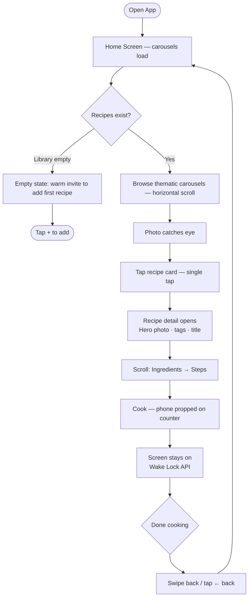
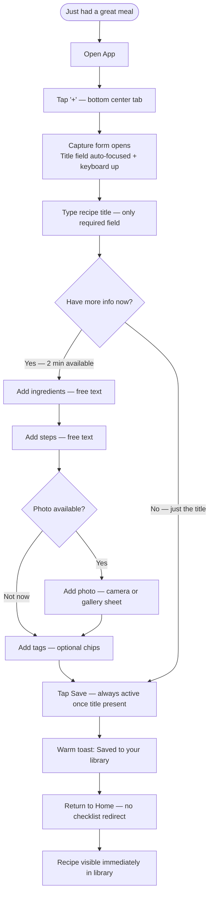
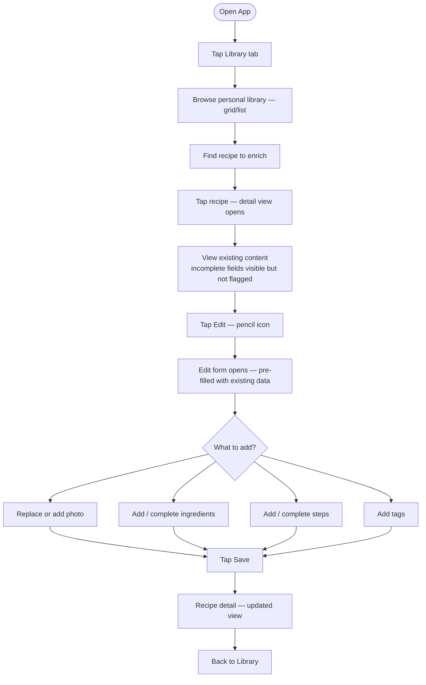
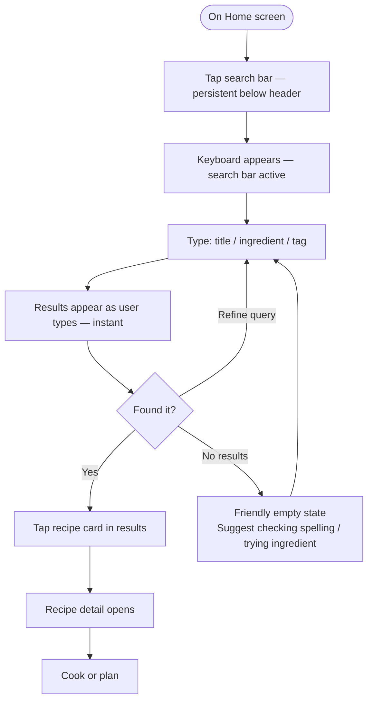
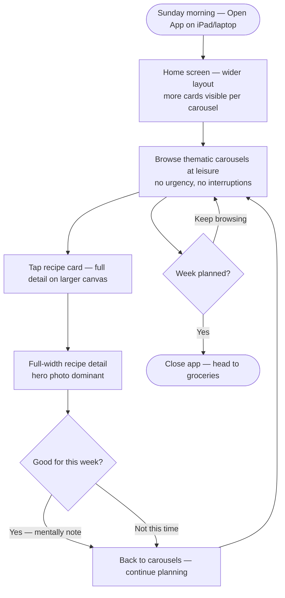

# UX Design Specification — atable

**Author:** Anthony
**Date:** 2026-02-28

---

<!-- UX design content will be appended sequentially through collaborative workflow steps -->

## Executive Summary

### Project Vision

atable is a photo-first personal recipe vault for intentional home cooks who want to own their culinary collection — not be managed by it. The experience borrows its visual language from Instagram (large photos, browsable carousels) and its warmth from Airbnb (calm, beautiful, trustworthy). There is no algorithmic suggestion engine. Only the recipes you chose, beautifully organized.

Success is felt, not tracked: the app is opened reflexively on Sunday for meal planning, and new recipes are added in the moment — immediately after a great meal — because the entry cost is low enough to make it worth it.

### Target Users

**Primary — The Household Curators (Anthony & Alice)**
A couple in their 30s who cook intentionally and do a weekly Sunday planning ritual. Their recipes currently live across phone Notes, screenshots, bookmarks, and memory. They need one beautiful, browsable place for *their* recipes.

Usage pattern has two distinct modes:
- **Phone** (primary): recipe capture immediately after a great meal; cooking companion while standing at the stove
- **iPad / desktop** (secondary): Sunday planning sessions, browsing carousels to pick the week's meals, a more leisurely experience

Recipe entry happens in two phases: a fast, minimal first add (title, photo, rough ingredients) done immediately in the moment, followed by completion later when there's more time. The UX must support partial/draft recipes gracefully — both at entry and in the reading view.

**Secondary — The Dinner Guest**
A friend or family member who receives a shared recipe link. Views on mobile, no account. Occasionally converts to their own library.

### Key Design Challenges

**1. Two-phase entry without "draft" complexity**
Users add recipes immediately (fast, incomplete) and complete them later. The form must feel light for the first add, yet make returning to enrich a recipe easy and obvious — without surfacing a confusing "draft" system or making incomplete recipes feel broken.

**2. Carousels with variable tag coverage**
V1 carousels rely entirely on manual tags. Since some recipes will initially have no tags (added later by user or AI in V2+), the home screen must handle thin/empty carousel states gracefully — without feeling broken or empty. The design should reward tagging without punishing its absence.

**3. Photo-resilient visual design**
Photos are central to the identity, but the first add often has no photo yet. The app must look beautiful with a photo, graceful without one, and make returning to add a photo feel easy.

**4. Cross-device continuity**
The same app serves a phone-first capture/cooking experience and a tablet/desktop Sunday planning session. Navigation patterns, carousel layouts, and reading views need to adapt meaningfully across screen sizes — not just reflow.

### Design Opportunities

**1. The Sunday planning ritual as a hero experience**
Weekly meal planning is a high-value, high-engagement moment. A well-designed carousel browsing experience on iPad/desktop — with thematic mood groupings, large imagery, and a "this week's picks" mental model — could make Sunday planning genuinely pleasurable rather than a chore.

**2. Instant capture as a habit loop**
If adding a recipe takes under 60 seconds on the phone, the behavior becomes reflexive. The entry form can be optimized as a "capture" moment: minimal required fields, everything optional except the title. The satisfaction of a quick add reinforces the habit.

**3. The cooking scroll as a calm ritual**
A single long-scroll reading view, with generous typography, clear ingredient/step separation, and the screen staying awake — creates a calming, focused cooking companion. A future enhancement (checkable steps) builds naturally on this foundation without requiring a mode switch.

## Core User Experience

### Defining Experience

atable has two equally essential core actions — and they happen at opposite moments of the day.

**Capture (the creation moment):**
Immediately after a great meal — at a restaurant, at a friend's, finishing a cookbook attempt — the phone comes out and a recipe is saved in under 60 seconds. Title, rough ingredients, nothing more if that's all there is time for. Done. The barrier must be low enough that this becomes reflex.

**Retrieve (the planning moment):**
On Sunday, browsing carousels on the iPad. A photo catches the eye. Tap. Full recipe. Planned for Tuesday. Done in minutes. The browsing must feel effortless enough that it replaces the mental overhead of "what do we cook this week?"

Both actions define the product's value. If capture is too slow, the library never grows. If retrieval isn't pleasurable, the library goes unused.

### Platform Strategy

**Primary surface — Mobile web (phone):**
Touch-only. One-handed when possible. Used standing in a kitchen or sitting on a couch right after a meal. Bottom navigation. Full-bleed imagery. Large tap targets. The screen must stay awake during cooking (wake lock API where supported).

**Secondary surface — Tablet / Desktop web:**
iPad on Sunday planning sessions; laptop occasionally. A more spacious, leisurely experience. Carousels become richer grids. Browsing feels editorial rather than urgent. Mouse/keyboard supported naturally through responsive layout — not a separate design.

**No native app (V1):** Responsive web app served from Vercel. No offline mode required for V1 — users are always on home WiFi during cooking. Entry experience should feel native despite being web (minimal chrome, focus on content).

### Effortless Interactions

These must require zero friction — any hesitation or extra step here breaks the habit loop:

**Recipe capture on phone:**
Tap "+" → title → optional ingredients → save. Photo is optional at any point — on first add, or later when a proper image is available. Nothing blocks saving. The recipe exists immediately, even as a stub. It can be enriched later.

**Carousel browsing:**
Home screen loads with thematic carousels immediately. Horizontal scroll on mobile, larger grid on tablet. A recipe opens with a single tap — no intermediate screen.

**Cooking scroll:**
Recipe view is a single continuous page: photo hero (or graceful placeholder) → ingredients → steps. Large typography. No modals, no pagination. The user scrolls as they cook. The screen stays on.

**Search:**
Accessible from any screen via a persistent search affordance. Returns results instantly as the user types. Searches title, ingredients, and tags.

### Critical Success Moments

**Moment 1 — The first save-instead-of-screenshot**
The first time Anthony puts his phone away after a great meal and thinks "it's in atable" instead of taking a screenshot. This is the habit loop forming. Entry must be fast enough to compete with the screenshot reflex.

**Moment 2 — The first Sunday where everything is in one place**
Anthony and Alice open the app, see carousels that reflect actual preferences, pick 4–5 meals, and feel like the week is planned. No cross-app hunting. No "I know we made something like this but I can't find it." This is the library earning its trust.

**Moment 3 — Opening a recipe while cooking and never losing your place**
Large text, clean layout, single scroll. The phone propped against a glass on the kitchen counter. No accidental navigation, no screen timeout, no confusion about which step comes next.

### Experience Principles

1. **Capture before complete.** A recipe saved incompletely is infinitely more valuable than one not saved. Never block, never require, never punish an incomplete entry. Completion — including the photo — can always come later.

2. **The library reflects your taste, not the algorithm's.** No suggestions. No "you might also like." Every recipe on screen is one you chose. The app is a mirror of your culinary identity.

3. **Phone is the primary canvas.** Every screen, every interaction designed first for one thumb, standing, in a kitchen or restaurant. Larger screens get more room, not different design logic.

4. **Beauty tolerates imperfection.** The visual design must look good with a stunning photo, a mediocre photo, and no photo at all. The identity doesn't depend on perfect photography — it depends on consistent, warm visual language.

## Desired Emotional Response

### Primary Emotional Goals

**Calm ownership.**
The dominant feeling of using atable should be quiet confidence — knowing your recipes are safe, organized, and yours. Not the low-grade anxiety of "I know I had that recipe somewhere." Relief. Settledness. The library is complete because you built it, and it reflects exactly your taste.

**Quiet pride.**
Browsing your own recipe library should feel like looking at something you've curated. Not a generic catalog — your culinary identity, beautifully presented. The same satisfaction as a well-organized bookshelf.

**Habit satisfaction.**
The small but real pleasure of adding a recipe in under a minute and knowing it will be there when you need it. The feeling of a system that actually works for you, not one that demands maintenance.

### Emotional Journey Mapping

| Moment | Target emotion | What creates it |
|---|---|---|
| First open | Recognition — "this is what I needed" | Clean, warm visual language; immediate clarity of purpose |
| First capture | Surprise at how fast it is | Minimal form, instant save, no friction |
| First retrieval | Relief — found in seconds | Fast search, carousels that surface the right thing |
| Sunday planning | Calm, almost meditative | Leisurely carousel browse; nothing urgent, nothing demanding |
| Cooking with the app | Focused presence | Single scroll, large text, screen stays on, nothing else competes |
| Returning after a week | Trust — it's still all there | Consistent, reliable, nothing changed behind your back |

### Micro-Emotions

**To cultivate:**
- **Confidence** over confusion — always clear where things are and how to get back
- **Trust** over skepticism — the library grows reliably; recipes don't disappear or break
- **Satisfaction** over effort — capture feels light and rewarding, not like homework
- **Calm** over urgency — no nudges, no badges, no pressure to complete anything

**To actively avoid:**
- **Obligation** — the app must never make you feel behind (incomplete recipes should not look broken or flagged)
- **Overwhelm** — no competing UI elements, no onboarding checklists, no feature discovery modals
- **Distraction during cooking** — reading mode should feel like the app disappeared and left only the recipe

### Design Implications

**Calm → minimal, unhurried UI**
Generous whitespace. A muted, warm palette. No notification dots on library items that need enrichment. Incomplete recipes look intentional, not broken.

**Pride → beautiful at every state**
Recipe cards and detail views must look considered whether they have a stunning photo, a mediocre snapshot, or no image at all. The design carries the visual weight when photography doesn't.

**Satisfaction from capture → warm, brief confirmation**
After saving a recipe, a simple warm acknowledgment ("Saved to your library") — not a redirect to a checklist of missing fields. The user chose what to enter; the app respects that choice.

**Focus during cooking → distraction-free reading mode**
No floating action buttons, no nudges to complete the recipe while cooking, no UI chrome competing with the content. The phone becomes a recipe holder, not an app.

### Emotional Design Principles

1. **Never make the user feel behind.** Incomplete recipes, missing photos, and untagged entries should look and feel intentional — not like failures waiting to be fixed.

2. **Earn trust through consistency.** The library should always be exactly where you left it. Nothing moves, nothing reorganizes itself without you. Predictability is the foundation of trust.

3. **Let the content carry the emotion.** The app's job is to frame the recipe beautifully and then get out of the way. UI that calls attention to itself during cooking or browsing is a failure of emotional design.

4. **Celebrate the small wins.** A recipe saved. A meal found in seconds. A Sunday planned. These moments should feel quietly satisfying — not through animation spectacle, but through the simple feeling of things working exactly as expected.

## UX Pattern Analysis & Inspiration

### Inspiring Products Analysis

**Instagram — Visual capture and browsable content**
The core UX lesson from Instagram is not social features — it's the relationship between content and chrome. The interface disappears; the image is everything. Key patterns:
- Full-bleed imagery with minimal overlay text — content is the UI
- Infinite vertical scroll with a strong visual rhythm
- Capture flow is camera-first, frictionless — posting is faster than not posting
- Cards are uniform in width, variable in engagement; browsing never feels like work

What atable borrows: the visual primacy of the image, the discipline of keeping UI chrome minimal, and the principle that capture must compete with doing nothing.

**Airbnb — Thematic browsing and warm trust**
Airbnb solved the problem of browsing an unfamiliar catalog by organizing it into emotionally resonant themes ("Cabins", "Beachfront", "Amazing views") — exactly the pattern atable needs for recipe carousels. Key patterns:
- Thematic category browsing as the primary discovery mode (not search, not list)
- Large hero photography on detail views; image earns trust before text
- Warm, calm visual palette — reassuring rather than exciting
- Progressive disclosure: listing overview → detail → booking; never everything at once
- Cards that feel curated, not generated — each feels hand-selected even at scale

What atable borrows: the thematic carousel model, the warm visual language, the hero image on recipe detail, and the progressive disclosure principle for recipe entry.

### Transferable UX Patterns

**Navigation patterns:**
- **Bottom tab bar (mobile)** — persistent, thumb-reachable navigation between Home, Search, and Add. Airbnb and Instagram both use this. Reduces cognitive overhead; users always know where they are.
- **Full-screen detail view** — recipe opens as a full-screen view (not a modal, not a sheet). Commits to the content fully.

**Interaction patterns:**
- **Horizontal carousel scroll** — Airbnb's category scrolling maps directly to atable's thematic carousels. Users already know this pattern intuitively.
- **Tap card → full detail** — single tap, no intermediate screen. Instagram's tap-to-open is the expected behavior for card-based browsing.
- **Camera/gallery picker at photo addition** — standard iOS/Android bottom sheet, nothing custom. Users know it; don't reinvent it.
- **Pull to refresh** — standard for feed-style content; users expect it.

**Visual patterns:**
- **Card with image + title only** — recipe cards show photo (or placeholder) and title. No metadata clutter on the card. Metadata lives on the detail view.
- **Warm neutral palette** — off-whites, warm grays, a single accent. Airbnb's visual language, not Instagram's high-contrast.
- **Large, readable typography on detail** — Airbnb's listing detail uses generous type sizing. atable's cooking view needs the same.

### Anti-Patterns to Avoid

**From existing recipe apps (derived from what users reject):**
- **Mandatory fields at entry** — requiring cooking time, difficulty, or calories before saving blocks the capture reflex. No field should ever be required except the title.
- **Mixed catalogs** — showing platform-suggested recipes alongside personal ones destroys the "this is mine" feeling. atable only shows what you added.
- **Dense list views as primary browse** — a list of recipe titles is a lookup tool, not a discovery experience. Carousels and cards are not optional.
- **Tagging as a user chore** — any UI that presents tagging as a required step at entry creates abandonment.
- **Incomplete-recipe guilt** — visual indicators, warning icons, or "complete your recipe" banners on cards are patronizing and create anxiety. Never do this.

**From general UX anti-patterns:**
- **Onboarding wizards** — this app has two users who don't need explaining to. Empty states should invite action, not instruct.
- **Bottom sheets for everything** — reserve sheets for contextual actions (photo picker, share). Navigation belongs in the tab bar.
- **Skeleton screens longer than 200ms** — if loading takes noticeable time, the architecture needs fixing, not a clever loader.

### Design Inspiration Strategy

**Adopt directly:**
- Instagram's full-bleed card imagery and minimal chrome approach
- Airbnb's thematic browsing model and warm visual palette
- Bottom tab navigation (Home / Search / Add) as the universal mobile pattern
- Single-tap card → full detail flow

**Adapt for atable's context:**
- Airbnb's hero image → atable's recipe hero with graceful no-photo state
- Instagram's capture flow → atable's recipe entry (title-first, not camera-first, since photo is optional)
- Airbnb's progressive disclosure → atable's two-phase entry (fast first add, enrich later)

**Avoid entirely:**
- Any recipe app pattern that requires metadata before saving
- Any UI pattern that visually penalizes incomplete content
- Any element that makes atable feel like a platform rather than a personal vault

## Design System Foundation

### Design System Choice

**Tailwind CSS + shadcn/ui**

A utility-first CSS approach (Tailwind) combined with a headless, unstyled component library (shadcn/ui), deployed on a Next.js codebase.

### Rationale for Selection

- **Full visual control**: Tailwind imposes no aesthetic — every visual decision is intentional. The warm, Airbnb-meets-Instagram palette, full-bleed imagery, and custom carousel layouts require custom visual work; Tailwind makes this fast rather than slow.
- **No aesthetic to fight**: MUI and Ant Design carry strong visual defaults that would need heavy overriding to achieve atable's look. Tailwind starts from zero.
- **shadcn/ui for accessible components**: Dialogs, forms, dropdowns, and sheets drop directly into the codebase as fully owned, unstyled components. Accessibility is handled; visual design is not imposed.
- **Native Next.js pairing**: Tailwind + shadcn/ui is the de facto standard in the Next.js ecosystem. Excellent documentation, active community, zero integration friction.
- **Solo developer fit**: High productivity without the overhead of maintaining a custom component system from scratch.

### Implementation Approach

- Tailwind CSS for all layout, spacing, color, and typography utilities
- shadcn/ui for interactive components: form inputs, dialogs, bottom sheets, dropdowns
- Custom components built on top of Tailwind primitives: recipe cards, carousel, hero image with placeholder, tab bar
- Design tokens defined as Tailwind config values: color palette, font scale, border radius, spacing

### Customization Strategy

- **Color palette**: Warm neutrals (off-white, warm gray, soft cream) with a single warm accent. Defined as CSS custom properties in Tailwind config.
- **Typography**: A single clean sans-serif for UI + optionally a serif for recipe titles to add warmth. Large scale for cooking view.
- **Spacing**: Generous — more whitespace than typical apps. Defined in Tailwind's spacing scale.
- **Components to build custom**: Recipe card (image + title, photo placeholder), thematic carousel, bottom navigation bar, recipe hero header, ingredient list, step list.
- **Components from shadcn/ui**: Form fields, photo picker sheet, confirmation dialogs, search input, toast notifications.

## Design Direction Decision

### Design Directions Explored

Four directions were explored, all using the Warm White & Olive palette with the revised 3-item navigation (Home / + / Library), search bar on the home screen, and account access in the home header:

1. **Éditorial** — Hero recipe at top, compact carousels below. Airbnb warmth.
2. **Full Bleed** — Wide immersive cards with photo overlay text. Maximum photo impact.
3. **Grille + filtres** — Tag chips + 2-column grid. More density, less discovery feel.
4. **Liste compacte** — Thumbnail rows grouped by category. Efficient but less visual.

Visual reference: `_bmad-output/planning-artifacts/ux-design-directions.html`

### Chosen Direction

**Direction 2 — Full Bleed, with editorial detail view**

Home screen: wide carousel cards (244px) with title and tag text overlaid on the photo. Recipe detail view: clean full-bleed photo with no overlay → tags + title displayed below on a white surface, separated from the image. Borrowed from Direction 1.

### Design Rationale

- Full-bleed carousel cards maximise photo impact during browsing — the defining discovery moment
- Separating title/tags from the photo on the detail view ensures legibility regardless of photo quality, and feels more editorial and considered
- The no-photo card state (olive gradient placeholder) works gracefully within the full-bleed format without breaking the visual rhythm
- 3-item nav (Home / + / Library) keeps navigation unambiguous; search lives on the home screen as a persistent bar rather than a nav destination

### Implementation Approach

**Navigation:** 3-tab bottom bar — Home (line icon), + (centered elevated olive circle), Library (grid icon). Account avatar top-right of home header.

**Home screen:** Logo + account avatar header → search bar → thematic carousels (section title + horizontal full-bleed card scroll).

**Recipe detail:** Full-bleed hero photo (no overlay) → back button top-left → below: tag chips → serif recipe title → divider → ingredients section → steps section. Single continuous scroll.

**Capture form:** Title (required, focused on open) → Ingredients (optional, free text) → Steps (optional, free text) → Tags (optional) → Photo (optional). Two separate fields for ingredients and steps to ensure structured data from V1, enabling reliable reading view display without AI parsing dependency.

## Core User Experience (Deep Dive)

### 2.1 Defining Experience

**atable in one sentence:** "Browse your own recipe collection like a food magazine — and save anything worth keeping in under a minute."

The defining experience, if we had to pick one, is **the browsing moment**: opening the app, scrolling a thematic carousel, seeing a photo that clicks, tapping it, and having the full recipe in front of you in under three taps. This is the moment that replaces a multi-app hunt with a single, beautiful interaction.

The capture experience is equally critical for library growth — but browsing is what makes users *return*. Nail the browse, and the habit forms. Nail the capture, and the library grows. Together they create the loop.

### 2.2 User Mental Model

Users arrive from a world of scattered recipe fragments: screenshots, bookmarks, Notes app entries, and memory. Their current mental model for finding a recipe is **search** — they know the name of what they want and go hunting for it. atable needs to introduce a second, more powerful mental model: **browsing by mood**.

"I want something quick" → browse Quick meals carousel → photo catches eye → done. This is a fundamentally different pattern from search, and it's the pattern that makes atable feel like a discovery tool rather than a lookup tool.

The good news: thematic carousels are a deeply familiar pattern (Netflix, Airbnb, Instagram). No learning curve. Users immediately understand "scroll this row to see more like this."

### 2.3 Success Criteria for Core Experience

**Browse → Cook flow succeeds when:**
- The home screen loads with at least one carousel immediately (no waiting)
- A recipe is reachable in 2 taps from the home screen
- The recipe detail view is fully legible without zooming or adjusting settings
- The screen does not dim or lock during normal cooking use
- There is no UI element that demands attention while cooking

**Capture flow succeeds when:**
- A new recipe can be saved with only a title in under 30 seconds
- The form never blocks saving due to missing optional fields
- After saving, the user lands back on the home screen (not a form review page)
- The new recipe appears in the library immediately, even without a photo or tags

### 2.4 Pattern Analysis: Established, Not Novel

atable does not require novel UX patterns — it requires familiar patterns executed with exceptional quality. The innovation is *context*, not *interaction mechanics*: applying feed browsing and card → detail navigation to a personal vault rather than a platform catalog.

**Established patterns adopted:**
- Thematic horizontal carousels (Netflix / Airbnb)
- Card tap → full-screen detail (Instagram / Airbnb)
- Bottom tab bar navigation (universal mobile standard)
- Form with optional fields (standard CRUD)
- Vertical scroll reading view (universal)

**Where quality matters most:**
The interaction patterns are familiar — which means the perceived quality comes entirely from execution: photography presentation, typography, spacing, transitions, and the absence of unnecessary chrome. A mediocre carousel is invisible; a beautiful one earns daily use.

### 2.5 Experience Mechanics

**Core flow: Browse → Cook**

| Stage | What happens |
|---|---|
| **Initiation** | User opens app. Home screen renders immediately with thematic carousels. No splash screen, no loading skeleton visible for more than ~150ms. |
| **Interaction** | User scrolls horizontally through a carousel. Card shows: photo (or warm placeholder) + recipe title only. Single tap opens the recipe. |
| **Transition** | Smooth push transition to recipe detail view. No modal, no sheet — a full committed navigation. |
| **Detail** | Hero photo (full-width) → recipe title → ingredient list → numbered steps. Single continuous scroll. Large, readable type. |
| **Cooking** | User places phone on counter. Screen stays on (wake lock). Scrolls as they progress. No interaction needed unless they want to edit. |
| **Completion** | Cooking done. User swipes back or taps back. Lands on home. |

**Core flow: Capture**

| Stage | What happens |
|---|---|
| **Initiation** | User taps "+" in bottom tab bar. Entry form appears. |
| **Interaction** | Title field is focused immediately. User types the recipe name. Adds rough ingredients if they have them. All other fields (steps, photo, tags) are visible but clearly optional. |
| **Feedback** | No validation errors for empty optional fields. Save button is always active once title is present. |
| **Completion** | Tap "Save". Brief warm confirmation ("Ajouté à votre bibliothèque"). Return to home screen. Recipe visible in library immediately. |
| **Later enrichment** | User taps the recipe in the library. Taps "Edit". Adds steps, photo, tags at their own pace. No pressure, no deadline. |

## Visual Design Foundation

### Color System

**Chosen direction: Warm White & Olive**

| Token | Value | Usage |
|---|---|---|
| `background` | `#F8FAF7` | App background — warm white with a whisper of green |
| `surface` | `#FFFFFF` | Cards, recipe detail background |
| `border` | `#E5DED6` | Subtle dividers, card outlines |
| `text-primary` | `#1A1F1A` | Headings, recipe titles, body text |
| `text-secondary` | `#6B6E68` | Labels, metadata, placeholders |
| `accent` | `#6E7A38` | Primary actions (Save button, active tab, links) |
| `accent-light` | `#EEF2E4` | Accent backgrounds, tag chips, subtle highlights |
| `overlay` | `rgba(26,31,26,0.4)` | Photo overlays for text legibility on cards |

**Accessibility:** Accent `#6E7A38` on white passes AA for large text; primary text `#1A1F1A` on `#F8FAF7` passes AAA. All interactive elements meet 4.5:1 minimum.

**Photo placeholder:** When no recipe photo exists, use a warm gradient (`#EEF2E4` → `#E5DED6`) with a centered olive icon — never a broken image state.

### Typography System

**Primary font — Inter**
Used for all UI elements, labels, ingredients, and step body text. Excellent screen rendering, free, ships with Tailwind/Next.js by default. Clean without being cold.

**Display font — Fraunces** *(optional, for recipe titles on detail view)*
A variable serif with warmth and personality. Used only for recipe name on the detail hero — creates an editorial, cookbook-like feel without affecting readability elsewhere. Fallback: Inter bold if Fraunces is not loaded.

**Type scale:**

| Role | Size | Weight | Usage |
|---|---|---|---|
| Display | 28px | 600 (Fraunces) | Recipe title on detail view |
| Heading | 20px | 600 | Section headers, carousel titles |
| Body | 17px | 400 | Ingredient lines, step text |
| Body Large | 20px | 400 | Step text in cooking view (increased for legibility) |
| Label | 14px | 500 | Tags, metadata, secondary labels |
| Caption | 12px | 400 | Timestamps, minor hints |

**Line height:** 1.5 for body text, 1.2 for headings. Generous leading throughout.

### Spacing & Layout Foundation

**Base unit:** 8px. All spacing is a multiple of 8.

**Spacing scale:**
- `xs`: 4px — tight internal spacing (icon + label gap)
- `sm`: 8px — within-component spacing
- `md`: 16px — between components, card padding
- `lg`: 24px — section separation
- `xl`: 32px — major section breaks
- `2xl`: 48px — page-level breathing room

**Card design:**
- Border radius: 14px — warm, not sharp, not bubbly
- Shadow: `0 1px 4px rgba(0,0,0,0.06)` — barely there, just enough to lift from background
- Image aspect ratio: 4:3 on carousel cards (landscape, shows food well)

**Layout:**
- Mobile: single column, 16px horizontal page padding, bottom tab bar 64px tall
- Tablet/Desktop: CSS grid, 2–3 column card grid, carousels become wider with more visible cards, side navigation replaces bottom tab bar at lg breakpoint

**Generous whitespace rule:** When in doubt, add 8px more. Cramped ≠ efficient for this product — breathing room is part of the calm identity.

### Accessibility Considerations

- All text meets WCAG AA contrast minimum (4.5:1 body, 3:1 large text)
- Tap targets minimum 44×44px on mobile (iOS/Android HIG standard)
- Focus states visible for keyboard navigation (desktop/tablet usage)
- Screen stays on during recipe view via Web Screen Wake Lock API (with graceful fallback if not supported)
- French language declared on `<html lang="fr">` for correct screen reader behaviour
- Photo alt text derived from recipe title (auto-generated, not empty)

## User Journey Flows

### Journey 1: Browse & Cook (Primary Weeknight Flow)

The defining experience — from couch to kitchen in 2 taps.



**Key design decisions:**
- Home screen must load immediately — carousels before any loader is visible
- Recipe is reachable in exactly 2 taps from home
- No modal, no sheet — full committed navigation push to detail
- Wake Lock activated automatically when recipe detail opens (with silent fallback if unsupported)

---

### Journey 2: Recipe Capture (In-the-Moment Fast Add)

Target: under 60 seconds from tap to saved.



**Key design decisions:**
- Title is the only required field — Save button is always active once it has content
- Keyboard appears immediately on form open — no tap needed to start typing
- After save: return to Home, not a "complete your recipe" review screen
- Toast confirmation is warm and brief — then disappears; no lingering guilt

---

### Journey 3: Recipe Enrichment (Return to Complete)

Completing a recipe saved in haste — on your own time, with zero obligation.



**Key design decisions:**
- Incomplete recipes in the library look intentional, not broken — no warning badges or completion indicators
- Edit form is pre-filled: only show what already exists, don't highlight what's missing
- All fields remain optional in edit mode — same rules as create

---

### Journey 4: Search (Lookup a Specific Recipe)

For when you know what you want — fast, direct retrieval.



**Key design decisions:**
- Search bar lives on the Home screen header — always visible, no dedicated nav tab needed
- Results appear on every keystroke — no search button, no submit gesture
- Searches title, ingredients, and tags simultaneously — one field, broad results
- Empty search state is warm, not alarming — suggests alternatives without implying the library is broken

---

### Journey 5: Sunday Planning (Tablet / Desktop)

The leisurely weekly ritual — deliberate, spacious, browsing as pleasure.



**Key design decisions:**
- Layout adapts meaningfully at tablet/desktop breakpoint — not just reflowed, actually better
- Carousels show more cards per row (grid-like) at wider breakpoints — Sunday browsing feels editorial
- Side navigation replaces bottom tab bar at lg breakpoint — thumb-reachable on tablet landscape
- No time pressure, no "start cooking" affordance on Sunday — pure browsing mode

---

### Journey Patterns

Consistent patterns across all flows:

**Navigation patterns:**
- **Bottom tab initiation (mobile):** All primary journeys start or pass through the bottom tab bar (Home / + / Library). No journey requires going more than 1 level deep into navigation to begin.
- **Single-tap card → detail:** A recipe is always 1 tap away from a card, regardless of context (carousel, search results, library). Zero intermediate screens.

**Interaction patterns:**
- **Always-available search:** Search bar is persistent on the Home screen — accessible from the most frequent starting point without a navigation tap.
- **Non-blocking save:** The Save action is always available the moment the recipe has a title. No other field gates saving — not steps, not photo, not tags.

**Feedback patterns:**
- **Warm, brief confirmations:** After save, a toast appears and fades — "Saved to your library." No redirect to a completion checklist. The user chose what to enter; the app respects that.
- **Graceful empty states:** No state (empty library, empty carousel, empty search) looks broken. Each invites the next natural action without obligation.

---

### Flow Optimization Principles

1. **Minimize steps to value.** Browse → Cook is exactly 2 taps from Home. Capture requires only a title and 1 tap to save. Any additional taps are optional, not required.

2. **Front-load the keyboard.** The capture form auto-focuses the title field with the keyboard open. Users should never have to tap to start typing.

3. **No gates on optional content.** The save button is active the moment a title exists. No field — not ingredients, not steps, not photo — ever blocks saving.

4. **Warm transitions, not jarring modals.** Recipes open as full navigation pushes (not bottom sheets or modals). The user commits to the content fully — and swipes back naturally.

5. **Screen awareness during cooking.** The Wake Lock API activates automatically in recipe detail view — users never need to manually prevent screen sleep. A graceful fallback exists for unsupported browsers.

## Component Strategy

### Design System Components (shadcn/ui — use as-is or lightly styled)

shadcn/ui provides accessible, unstyled components that slot into atable with palette + spacing applied:

| Component | Usage in atable |
|---|---|
| `Button` | Save, Edit, actions throughout |
| `Input` | Title field in capture form; basis for search bar |
| `Textarea` | Ingredients and steps fields in capture/edit form |
| `Sheet` | Photo picker bottom sheet (camera / gallery options) |
| `Toast` | Post-save confirmation ("Saved to your library") |
| `Badge` | Tag chips — restyled with olive accent palette |
| `Avatar` | Account avatar in home header (V2) |
| `Separator` | Dividers in recipe detail view |
| `Skeleton` | Loading states for card images and initial carousel load |
| `Dialog` | Delete confirmation (destructive action guard) |

**Gap analysis:** The core visual identity of atable — the recipe card, carousel, bottom nav, hero header, and cooking reading view — has no equivalent in shadcn/ui. These require custom components built on Tailwind primitives.

---

### Custom Components

#### RecipeCard

**Purpose:** The primary browsable unit — appears in carousels, search results, and the library. The most-seen component in the app.

**Anatomy:**
- Full-bleed image (4:3 aspect ratio, `object-cover`)
- Overlay gradient (bottom-to-top, semi-transparent) — only when photo exists
- Recipe title (overlaid on photo, or below if no photo)
- No metadata on the card — title only

**States:**
- `with-photo`: full-bleed image + title overlay text
- `no-photo`: warm gradient placeholder (`#EEF2E4` → `#E5DED6`) + olive icon centered + title below card
- `loading`: skeleton shimmer at 4:3 ratio
- `pressed`: subtle scale-down (0.97) on tap

**Variants:**
- `carousel` (default): 200px wide on mobile, flexible in grid on tablet
- `library-grid`: square or 3:4 in 2-column library grid

**Accessibility:** `role="button"` with `aria-label="[Recipe title]"`. Image `alt="[Recipe title]"`. Minimum 44×44px tap target.

---

#### ThematicCarousel

**Purpose:** The primary discovery surface on the home screen. Groups recipes by theme, enabling browse-by-mood.

**Anatomy:**
- Section header: theme title (Heading style) + optional "Voir tout" link
- Horizontal scroll container (snap scrolling, `scroll-snap-type: x mandatory`)
- Row of RecipeCards — 2.2 cards visible on mobile to signal more content
- No scroll indicators/dots (overflow creates natural affordance)

**States:**
- `populated`: normal — cards visible
- `thin` (1–2 recipes): shows cards + remainder of next card to invite scroll
- `empty`: not rendered — carousels with no recipes don't appear at all

**Variants:** Mobile horizontal scroll (200px cards) vs. tablet wider cards (240px), same pattern.

**Accessibility:** `role="region"` with `aria-label="[Theme name] recipes"`. Keyboard arrow navigation through cards.

---

#### BottomNavBar

**Purpose:** Persistent navigation across all primary app screens. The only global navigation element on mobile.

**Anatomy:**
- Fixed to bottom, full width, 64px tall + safe area inset
- Background: `surface` (#FFFFFF) with subtle top border
- 3 items: Home (line icon) | + (elevated olive circle, 52px) | Library (grid icon)
- Active tab: olive accent icon + label; inactive: `text-secondary`

**States:** `home-active`, `library-active`. The + button is always elevated — never in an "active" resting state.

**Accessibility:** `role="navigation"` with `aria-label="Navigation principale"`. `aria-current="page"` on active tab. Each item minimum 44×44px tap target.

---

#### RecipeHero

**Purpose:** Full-bleed header image on the recipe detail view. First thing seen after tapping a card.

**Anatomy:**
- Full-width image, 56vw tall on mobile
- Back button: top-left, white icon on semi-transparent dark pill
- No title overlay — title lives below in the content section
- `no-photo` state: warm gradient full-width, same height, centered olive icon

**States:** `with-photo`, `no-photo`, `loading` (skeleton shimmer).

**Accessibility:** Back button `aria-label="Retour"`. Image `alt="Photo de [recipe title]"`.

---

#### IngredientList

**Purpose:** Display recipe ingredients in the cooking/reading view. Scannable at a glance, readable from a distance.

**Anatomy:**
- Section header: "Ingrédients" (Heading 20px)
- List items: quantity + unit (`text-secondary`) + ingredient name (`text-primary`)
- Generous line spacing (1.6) for kitchen readability
- Subtle divider between each item

**States:** `populated` | `empty` (light "Aucun ingrédient ajouté" — not alarming).

**Content guidelines:** Free-text rendered as-is. Each newline = one ingredient line. No parsing in V1.

**Accessibility:** `role="list"` / `role="listitem"` per ingredient. Proper heading level.

---

#### StepList

**Purpose:** Display recipe steps in the cooking/reading view. Must be readable from counter distance.

**Anatomy:**
- Section header: "Préparation" (Heading 20px)
- Numbered steps: large step number (olive accent, 24px bold) + step text (Body Large 20px, 1.6 line height)
- 24px padding between steps
- No step interaction in V1 — pure reading

**States:** `populated` | `empty` (light "Aucune étape ajoutée").

**Content guidelines:** Each newline in the steps field = one step. Numbered automatically by the component.

**Accessibility:** `role="list"` / `role="listitem"`. Step numbers `aria-hidden="true"` — decorative only.

---

#### PhotoPlaceholder

**Purpose:** Warm, intentional fallback when a recipe has no photo. Must never look like a broken or missing image.

**Anatomy:**
- Gradient fill: `#EEF2E4` → `#E5DED6` (vertical)
- Centered olive culinary icon (fork/bowl SVG), size scales with context
- Same visual in both RecipeCard and RecipeHero (different sizes)

**Reuse:** Single source of truth, used inside RecipeCard (no-photo) and RecipeHero (no-photo).

---

#### SearchBar

**Purpose:** Persistent text input for instant recipe search. Lives in the Home screen header — always accessible from the primary screen.

**Anatomy:**
- Full-width input, 48px tall, subtle border
- Left: search magnifier icon (olive, 20px)
- Placeholder: "Rechercher une recette…"
- Right: clear button appears when text present
- Lives below the logo/account header row, above first carousel

**States:** `idle` | `focused` (focus ring + keyboard) | `has-value` (clear button visible) | `results-showing` (carousels replaced by results).

**Accessibility:** `role="searchbox"` with `aria-label="Rechercher une recette"`. Clear button `aria-label="Effacer la recherche"`.

---

### Component Implementation Strategy

**Principle:** Build on the design system foundation, never around it. All custom components use Tailwind utility classes — never hard-coded values. Design tokens from Tailwind config flow through every component consistently.

**Custom component hierarchy:**
```
Tailwind config tokens (colors, fonts, spacing)
    └── shadcn/ui primitives (Button, Input, Sheet, Toast, Badge...)
        └── Custom components (RecipeCard, ThematicCarousel, BottomNavBar...)
            └── Page layouts (Home, RecipeDetail, CaptureForm, Library)
```

**Reuse strategy:**
- `PhotoPlaceholder` is a child of both `RecipeCard` and `RecipeHero` — single source of truth
- `RecipeCard` is reused in ThematicCarousel, SearchResults, and LibraryGrid
- `BottomNavBar` is a single instance at the app root level — never re-rendered per page

---

### Implementation Roadmap

**Phase 1 — Core (required for Browse & Cook + Capture flows):**
- `PhotoPlaceholder` — dependency for Phase 1 cards and hero
- `RecipeCard` — required for any browsable surface
- `ThematicCarousel` — required for Home screen
- `BottomNavBar` — required for navigation between flows
- `RecipeHero` — required for recipe detail view
- `IngredientList` — required for cooking view
- `StepList` — required for cooking view

**Phase 2 — Supporting (required for Search + Library flows):**
- `SearchBar` — persistent Home header element
- Tag chips (styled shadcn `Badge`) — recipe detail + capture form
- Save confirmation (shadcn `Toast`, styled) — capture flow completion
- Photo picker (shadcn `Sheet`, styled) — capture/edit flow

**Phase 3 — Enhancement (polish + enrichment flow):**
- Library grid view (RecipeCard in grid layout variant)
- Empty state components (per-context: empty library, empty carousel, empty search)
- Edit form layout (reuses capture form with pre-filled data)
- Wake lock controller (non-visual utility hook — `useWakeLock`)

## UX Consistency Patterns

### Button Hierarchy

atable uses a strict 4-level button hierarchy. Per-screen, there should never be more than one primary action.

| Level | Visual | Usage |
|---|---|---|
| **Primary** | Olive fill (`#6E7A38`), white text, 48px tall, full-width on mobile | Single dominant action: Save, Add recipe |
| **Secondary** | Outlined (1px `border` color), `text-primary`, same sizing | Alternative path: Cancel, Edit (when not icon-only) |
| **Ghost / Text** | No border, no background, olive text | Low-priority tertiary: "Retirer la photo", "Voir tout" |
| **Icon** | Icon only, 44×44px tap target, `text-secondary` | Back navigation, Edit (pencil), Camera, Delete (trash) |
| **Destructive** | Red fill or red text — never olive | Delete confirmation only, inside a dialog |

**Rules:**
- One primary button per screen — never two filled olive buttons competing
- Destructive actions (delete) never appear as primary buttons in the main flow — only inside a confirmation dialog
- The + in BottomNavBar is its own visual language (elevated olive circle) — not governed by this hierarchy
- Save button in the capture form is always active once the title field has content — never disabled

---

### Feedback Patterns

**Success:**
- Trigger: recipe saved, recipe updated
- Pattern: warm toast — "Ajoutée à votre bibliothèque" — appears bottom-center for 3 seconds then fades
- No redirect to a completion checklist, no persistent confirmation screen
- Visual: olive background, white text, rounded, 16px padding — matches brand warmth

**Error (form):**
- Trigger: tap Save with no title entered (the only case this can happen)
- Pattern: red border on the title field + brief message below — "Le titre est requis"
- Never fires while typing — only on save attempt
- Never shows errors for optional fields that are empty

**Error (network/system):**
- Trigger: recipes fail to load, save fails
- Pattern: subtle inline banner — "Impossible de charger les recettes. Vérifiez votre connexion." — no modal, no drama

**Warning:**
- atable has no warning states in V1 by design. Incomplete recipes are intentional, not problematic.

**Loading:**
- Always contextual — never a global full-screen spinner
- Carousel loading: skeleton cards at 4:3 ratio in carousel positions (shimmer animation)
- Recipe detail image loading: skeleton at correct hero height
- Max visible skeleton: ~150ms. If loading consistently takes longer, it's an architecture problem.
- No progress bars — atable operations are instantaneous or near-instantaneous

---

### Form Patterns

**Capture / Edit form:**
- Single-page form — no multi-step wizard, no tabs
- Field order: Title (required) → Ingredients → Steps → Tags → Photo
- Labels above every field — never placeholder-as-label (accessibility requirement)
- Required indicator: Title field has "(requis)" suffix. No asterisk system — it's the only required field.
- All other fields have "(optionnel)" suffix — explicit, not implied

**Validation:**
- Validates only on save attempt — never while typing, never on blur
- Error state: 1px red border + small red message directly below the field
- One error at a time — only title error shown on submit; don't pre-validate optional fields

**Textarea behavior:**
- Auto-grow with content — no fixed height with scroll inside
- Minimum height: 120px; expands as user types
- No character limits
- Ingredients and Steps are separate fields — ensures structured reading view in V1

**Photo field:**
- Appears as a large dashed-border placeholder zone (or photo preview if photo added)
- Tap anywhere → opens bottom sheet with camera / gallery options
- If photo added: preview at 4:3 with "Retirer la photo" ghost button below
- Never required, never an error state

**Save button:**
- Always visible (sticky at bottom of form on mobile)
- Active: olive fill — available as soon as title has any content
- Inactive: muted (`accent-light` background) — only when title is empty
- After save: brief toast → return to previous screen

---

### Navigation Patterns

**Primary navigation (mobile):**
- Bottom tab bar: Home / + / Library — always visible
- Active tab: olive icon + olive label; inactive: `text-secondary`

**Primary navigation (tablet/desktop ≥ lg breakpoint):**
- Side navigation replaces bottom tab bar
- Same 3 items, vertical layout, left rail
- + becomes a prominent "Ajouter une recette" button at top of rail

**Forward navigation:**
- Recipe detail views: full-screen push navigation — committed, not a sheet
- Back gesture (swipe right on mobile) always works
- Back button: top-left, always visible in recipe detail and edit form

**Back navigation:**
- After save (new recipe): back to Home
- After save (edit): back to recipe detail
- Swipe right OR tap back button — both always work

**Sheet / overlay usage (reserved):**
- Photo picker: bottom sheet only
- Delete confirmation: dialog only
- Nothing else uses sheets or dialogs in V1

**Sheet pattern:**
- Always has a visible handle bar at top
- Tapping outside = dismiss (same as Cancel)
- No nested sheets

---

### Empty States

**Empty library (first use):**
- Heading: "Votre bibliothèque est vide"
- Body: "Commencez par ajouter une recette que vous aimez."
- Primary button: "Ajouter une recette" → opens capture form

**Empty carousel:**
- Not shown. Carousels with zero matching recipes are silently omitted — the home screen never renders an empty carousel section.

**Empty search results:**
- "Aucun résultat pour « [query] »"
- Subtext: "Essayez avec un autre titre, ingrédient ou tag."
- No button — just an invitation to refine

**Loading (any context):**
- Skeleton cards in the expected layout shape
- Shimmer animation (subtle)
- Skeletons appear only if load exceeds ~100ms

---

### Destructive Action Patterns

**Delete recipe flow:**
1. Recipe detail → Edit → "Supprimer la recette" (ghost/text button, bottom of edit form)
2. Confirmation dialog: "Supprimer cette recette ?" / "Cette action est irréversible." → "Annuler" (default) | "Supprimer" (destructive, red)
3. Confirm: recipe deleted → return to Library → toast: "Recette supprimée"

**Rules:**
- No swipe-to-delete in V1
- Delete is never a primary action, never olive
- Cancel is always the visually dominant option in the dialog

---

### Photo Interaction Patterns

**Adding a photo:** Tap photo zone → bottom sheet: "Appareil photo" | "Galerie de photos" → no crop step → preview appears.

**Replacing a photo (edit):** Tap existing photo preview → same bottom sheet.

**Removing a photo (edit):** "Retirer la photo" ghost/text link below preview → no confirmation needed (reversible) → returns to placeholder zone.

**Display rules:** Always `object-cover` at 4:3 ratio. If image fails to load: `PhotoPlaceholder` appears — never a broken image icon.

---

### Incomplete Recipe Handling

**In the library / carousels:**
- No photos: `PhotoPlaceholder` (gradient + icon) — intentional, not broken
- No tags: recipe still appears in library; simply absent from tag-based carousels
- No badges, no completion indicators, no "draft" label — ever

**In the recipe detail view:**
- Ingredients section: only renders if ingredients content exists — if empty, the section doesn't appear at all
- Steps section: same — only renders if steps exist
- A title-only recipe shows: hero (or placeholder) → title → nothing else. Valid and complete-feeling.

**In the edit form:**
- Pre-filled with whatever exists — no visual indication of what's "missing"
- No completion percentage, no checklist of required fields, no nudges

## Responsive Design & Accessibility

### Responsive Strategy

atable has two genuinely distinct usage contexts, each with a different mental model. The design adapts meaningfully between them — not just reflowing content.

**Mobile (primary canvas — phone):**
The cooking and capture device. One-handed when possible. Standing in a kitchen or sitting right after a meal. Every primary interaction is designed here first. Bottom navigation, single-column layouts, full-bleed imagery, large tap targets, keyboard-up forms.

**Tablet / Desktop (secondary canvas — iPad / laptop):**
The Sunday planning device. Leisurely, seated, two hands, more screen. The experience expands meaningfully — more cards visible per carousel row, side navigation in place of the bottom bar, wider recipe detail, more editorial feel. Not a reflowed phone — a better version of the same app for a different moment.

**Key principle:** No feature exists on desktop that doesn't exist on mobile. No layout change is cosmetic — every breakpoint shift serves the use case of that screen size.

---

### Breakpoint Strategy

atable uses a **mobile-first** approach with **one meaningful breakpoint** at `lg` (1024px). A `md` breakpoint applies only minor refinements — the fundamental layout shift happens at `lg`.

| Breakpoint | Range | Layout mode |
|---|---|---|
| Default (mobile) | 0 – 767px | Phone layout — bottom nav, single column, full-bleed |
| `md` | 768px – 1023px | Tablet portrait — mostly mobile layout; slightly wider cards |
| `lg` | 1024px+ | Tablet landscape / desktop — side nav, grid carousels, wider content |

**Tailwind usage:** Base styles → mobile. `md:` → minor tablet refinements. `lg:` → full layout shift.

**Why one meaningful breakpoint:** atable has two use cases, not three. One clear inflection point — the `lg` shift — is simpler to implement, test, and maintain.

---

### Layout Adaptations by Breakpoint

**Navigation:**
- Mobile: `BottomNavBar` — fixed, 64px tall, 3 tabs
- `lg+`: Side rail — left-fixed, 220px wide, vertical tabs. + becomes "Ajouter une recette" primary button at top of rail.

**Home screen:**
- Mobile: Logo + avatar header → search bar → stacked carousels (200px cards, horizontal scroll)
- `lg+`: Side nav visible → main content 3/4 width → carousels show 3–4 cards before overflow

**Recipe detail:**
- Mobile: Full-width stack — hero image 56vw tall → content below, 16px padding
- `lg+`: Hero image max-height 480px → centered content column, max-width 720px

**Capture / edit form:**
- Mobile: Full-screen form, sticky save button at bottom
- `lg+`: Centered card with max-width 600px, shadow — same fields, same behavior

**Library:**
- Mobile: 2-column card grid
- `lg+`: 3-column card grid, cards larger

---

### Accessibility Strategy

**Target compliance level: WCAG 2.1 Level AA**

**Color contrast (established in Visual Design Foundation):**
- `text-primary` (#1A1F1A) on `background` (#F8FAF7): 18.5:1 — exceeds AAA
- `accent` (#6E7A38) on `surface` (#FFFFFF): 4.6:1 — passes AA
- `text-secondary` (#6B6E68) on `background`: 5.1:1 — passes AA

**Touch targets:**
- Minimum 44×44px on all interactive elements
- BottomNavBar items: full-height zones (64px tall per item)
- + button: 52×52px visible with 60×60px hit area via padding
- Recipe cards: naturally large — no minimum concern

**Focus management:**
- Visible focus ring: 2px solid olive (`#6E7A38`) with 2px offset on all interactive elements
- Recipe detail opens: focus moves to `<h1>` (recipe title)
- Back navigation: focus returns to the recipe card that was activated
- Capture form opens: focus moves immediately to the title input

**Screen reader support:**
- `<html lang="fr">` declared
- Semantic HTML: `<nav>`, `<main>`, `<section>`, `<article>`, `<h1>`–`<h3>` hierarchy
- `role="list"` / `role="listitem"` on ingredient and step lists
- `role="region"` with `aria-label` on each thematic carousel
- Image `alt` derived from recipe title — never empty, never generic
- Decorative elements (step numbers, placeholder icon): `aria-hidden="true"`
- Toast notifications: `role="status"` with `aria-live="polite"`

**Keyboard navigation:**
- All actions reachable via keyboard: Tab, Enter/Space to activate, Escape to dismiss overlays
- Carousel: arrow keys to move between cards
- Bottom sheet: Escape to dismiss; focus trapped within sheet while open
- Dialog: Escape to cancel; focus trapped; Cancel is first focusable element

**Motion sensitivity:**
- `@media (prefers-reduced-motion: reduce)`: disable skeleton shimmer, card press scale, toast slide-in
- Keep opacity fades at slower duration (still functional)
- All animations are additive — the experience is complete without them

**Text scaling:**
- All layouts work at 200% browser text zoom without horizontal scroll
- Relative units (rem, %, fr) throughout — no fixed-pixel font sizes or container widths

**Wake Lock:**
- Activates automatically on recipe detail view mount
- Graceful silent fallback if API not supported — no error shown, no broken experience
- No UI indicator for wake lock state

---

### Testing Strategy

| Priority | Target | Tool |
|---|---|---|
| Critical | iPhone / iOS Safari — browse + capture flows | Real device |
| Critical | iPad landscape / Safari — Sunday planning | Real device |
| High | VoiceOver on iOS — all primary flows | Real device |
| High | Keyboard-only navigation (Tab through everything) | Chrome DevTools |
| High | Chrome DevTools mobile simulation | Development |
| Medium | Color contrast verification | axe DevTools |
| Medium | `prefers-reduced-motion` behavior | Chrome DevTools media simulation |
| Medium | MacBook Safari / Chrome | Real device |
| Low | 200% browser zoom — no horizontal scroll | Browser |

**Automated:** `eslint-plugin-jsx-a11y` in dev pipeline — catches missing alt text, empty aria-labels, invalid ARIA at write time.

---

### Implementation Guidelines

**CSS approach:**
- Mobile-first: base styles are mobile; `lg:` prefixes add tablet/desktop overrides
- Never use fixed pixel widths on layout containers — use `max-w-*` with `mx-auto`
- Typography via Tailwind's rem-based scale — respects browser text zoom
- 8px spacing base unit, Tailwind's `p-*` / `m-*` scale throughout

**Images:**
- `next/image` for all recipe photos — automatic WebP/AVIF, lazy loading, blur placeholder
- Always populate `alt` from recipe title — never empty string on content images
- Use `fill` layout with a sized container on cards — prevents layout shift

**Touch interactions:**
- No hover-only interactions — anything shown on hover must also be reachable via tap
- Long press not used — undiscoverable and platform-specific
- Swipe right for back is native browser behavior — don't override it

**Wake Lock implementation:**
```typescript
const useWakeLock = () => {
  useEffect(() => {
    if (!('wakeLock' in navigator)) return; // silent fallback
    let wakeLock: WakeLockSentinel | null = null;
    navigator.wakeLock.request('screen').then(wl => { wakeLock = wl; });
    return () => { wakeLock?.release(); };
  }, []);
};
```

**Semantic structure per page:**
- Home: `<main>` → `<section aria-label="[theme]">` per carousel + `<nav aria-label="Navigation principale">`
- Recipe detail: `<main>` → `<article>` → `<h1>` (title) → ingredients `<section>` → steps `<section>`
- Capture form: `<main>` → `<form>` with labeled fields, single primary action
