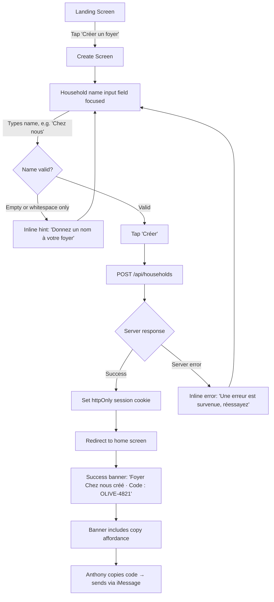
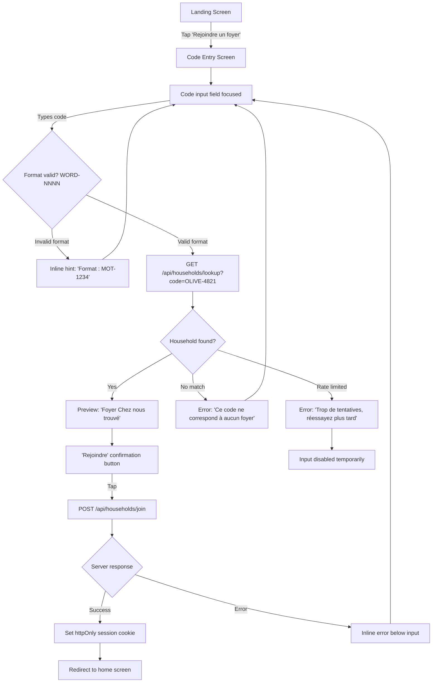
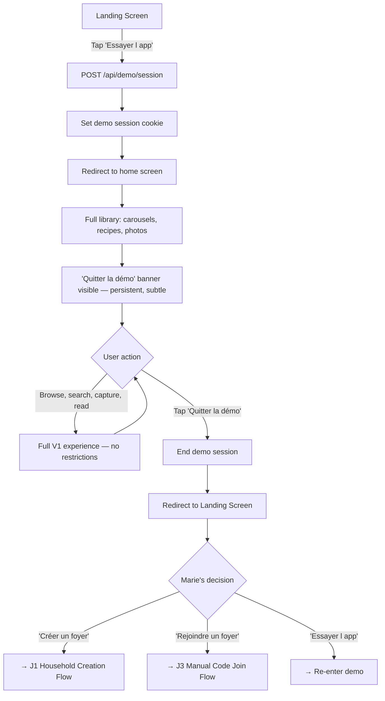
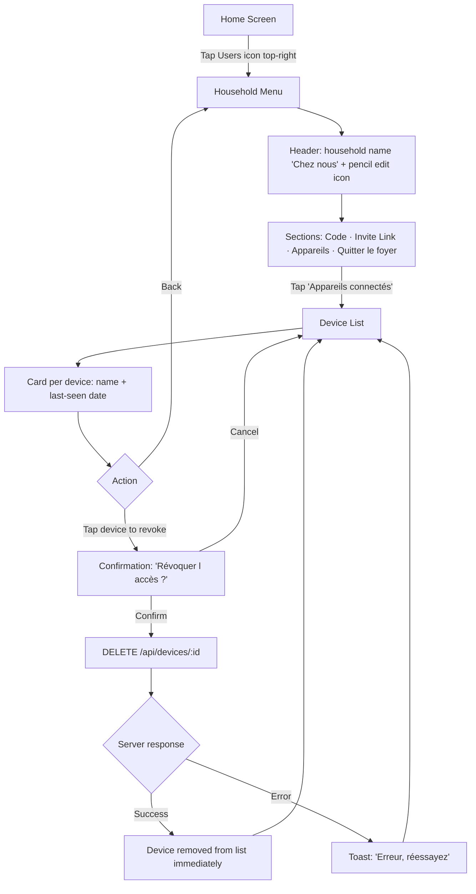
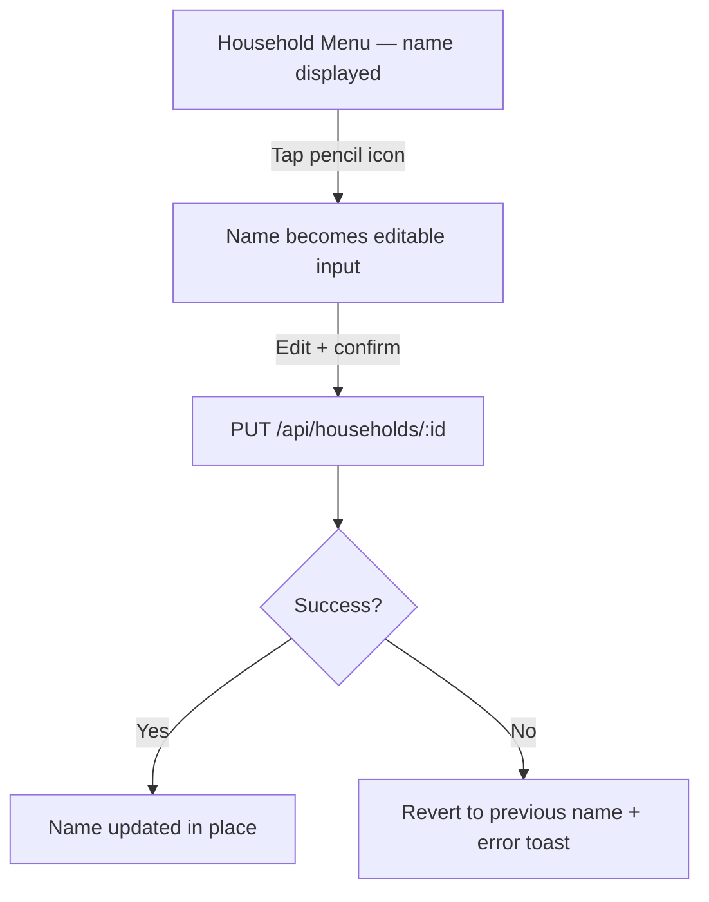
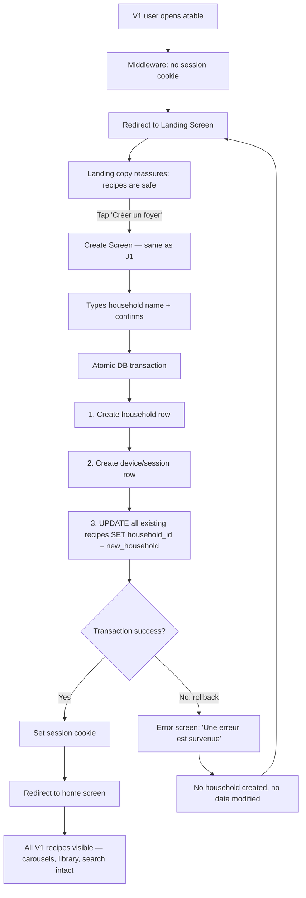

# UX Design Specification — atable v2.0 (Household Auth)

**Author:** Anthony
**Date:** 2026-03-02

---

<!-- UX design content will be appended sequentially through collaborative workflow steps -->

## Executive Summary

### Project Vision

atable v2.0 adds household identity to the existing personal recipe vault. V1 is complete and deployed — a shared recipe library accessible by URL with no concept of ownership. V2 introduces the missing layer: a household account that turns the library from "accessible to anyone with the link" into "our kitchen's private vault."

The UX challenge is surgical: add an auth system that feels invisible after a 30-second setup. The household model (no individual accounts, no emails, no passwords) demands UX patterns that are simpler than standard auth — not a stripped-down version of it. The design language must be continuous with V1's warm, photo-first aesthetic while introducing entirely new screen types (landing, join, demo, device management) that feel native to the existing app.

### Target Users

**Anthony (Household Creator)** — Existing V1 user. Opens atable after the V2 deploy and sees the landing screen for the first time. Needs to understand immediately: recipes are safe, just create a household to access them. Creates "Chez nous," gets the code, sends it to Alice. Expects zero disruption to his daily recipe workflow afterward.

**Alice (Household Joiner)** — Receives an invite link via iMessage. Taps it, sees the household name, confirms with one tap. Expects immediate access to the shared library. If the link fails, she needs a fast manual code path that doesn't feel like a degraded experience.

**Marie (Demo Explorer → Converter)** — A friend who heard about atable at dinner. Opens it the next day with zero commitment. Demo mode must deliver the full emotional experience of a well-stocked recipe library. The conversion to her own household must be frictionless and obvious when she's ready — but never pushy.

### Key Design Challenges

1. **Landing screen as reassurance for existing users** — V1 users encounter a new gate on a familiar app. The screen must instantly communicate safety ("your recipes are here") while making the 3 options (create / join / demo) unambiguous. Any confusion here risks losing trust built over months of daily use.

2. **Auth that disappears after setup** — The entire value proposition is long-lived device trust (~1 year sessions). The onboarding flow must feel like a brief formality. Every unnecessary field, confirmation dialog, or loading state erodes the "invisible auth" promise.

3. **Cross-app invite link reliability on iOS** — The `/join/[CODE]` link must work from WhatsApp, SMS, iMessage, and email on iOS Safari. When it doesn't (blank page, wrong app), the manual code fallback must be immediately discoverable and equally fast.

4. **Demo mode that sells without selling** — Demo is a shared sandbox with realistic French recipe data. It must showcase the full V1 experience (carousels, search, capture, reading view) while maintaining a non-intrusive conversion path. The line between "try it" and "keep it" must be a single natural step.

### Design Opportunities

1. **Household naming as emotional ownership** — "Chez nous" isn't a username — it's a statement. The naming moment and the human-readable code format (`OLIVE-4821`) are opportunities for warmth and personality in an otherwise utilitarian auth flow.

2. **Demo as the ultimate product showcase** — Pre-seeded with beautiful, realistic French recipes, demo mode is the app at its aspirational best. This is the one screen where new users experience atable fully stocked — the visual argument for why they should create their own household.

3. **Device management as transparent trust** — Showing device names and last-seen dates communicates control without complexity. In a world of "who has access to my account?" anxiety, a clean device list with one-tap revocation is a quiet trust signal.

## Core User Experience

### Defining Experience

The V2 auth system is not a feature users engage with — it's a gate they pass through once and forget. The core experience is **the absence of the experience**: after a sub-60-second setup, the auth layer becomes invisible and the V1 recipe library resumes as the primary interaction surface.

The single interaction that defines V2's success: **Alice taps an invite link from iMessage, sees the household name, confirms with one tap, and lands in the shared library.** If this flow takes more than 10 seconds or requires any typing, the household model has failed its primary test.

### Platform Strategy

| Dimension | Decision |
|---|---|
| **Platform** | Next.js App Router PWA — same as V1, no change |
| **Primary surface** | iOS Safari on iPhone — touch-first, one-handed |
| **Secondary surface** | iOS Safari on iPad, Chrome mobile, macOS desktop |
| **Critical new constraint** | Invite links must open correctly from WhatsApp, SMS, and iMessage on iOS. This means navigating in-app browsers (WhatsApp WebView) and Safari handoffs. `sameSite: lax` cookies are required for this to work. |
| **Offline** | Not required — same as V1. Auth flows require network. |
| **Device capabilities** | No new device APIs needed. Device identification (name, OS, browser) is derived server-side from User-Agent for the device management list. |

### Effortless Interactions

| Interaction | Effortless standard |
|---|---|
| **Join via invite link** | One tap after the link opens. No typing, no code entry, no form fields. The household name is pre-identified from the URL. |
| **Household creation** | One field (household name), one tap (confirm). The join code and session are created silently. |
| **Demo entry** | One tap from the landing screen. No name, no email, no explanation. Immediately inside a full recipe library. |
| **Post-setup daily use** | Identical to V1. No auth prompts, no session warnings, no visible difference. The middleware gate is invisible on every request. |
| **Device revocation** | Two taps from the household menu: select device → confirm revoke. No password re-entry, no verification step. |

### Critical Success Moments

1. **The invite link tap** — Alice taps the link Anthony sent via iMessage. The app opens with "Rejoindre *Chez nous*?" already displayed. One confirmation tap. She's in the library. This is the moment that proves the household model is simpler than traditional auth, not a weird version of it.

2. **The landing screen first impression** — A new user (or demo explorer) sees three unambiguous choices. There's no confusion about what a "household" is or what each option does. The screen communicates warmth and simplicity, not a login wall.

3. **Demo → "I want this"** — Marie browses a beautiful, fully-stocked library for 10 minutes. The conversion CTA appears naturally. She taps it, names her household, and the transition from demo to ownership is seamless. The demo didn't feel like a trial — it felt like the real thing.

4. **First shared library moment** — Both Anthony and Alice see the same recipes from different devices. The library is "ours" — same carousels, same content, same home screen. The household model clicks.

### Experience Principles

| Principle | What it means in practice |
|---|---|
| **One field, one tap** | Every auth flow resolves in the minimum possible interactions. Creation = one field + one tap. Join by link = one tap. Demo = one tap. No flow asks for two pieces of information. |
| **Auth is invisible after setup** | Once a session is established, V2 adds zero visible changes to V1. No session indicators, no "logged in as" badges, no periodic re-auth. The household menu exists but doesn't surface uninvited. |
| **Fail to landing, not to error** | Any auth failure (expired session, revoked device, invalid cookie) produces a clean redirect to the landing screen — never a 500, never a broken state, never a cryptic error message. |
| **The fallback is still fast** | When the invite link doesn't work (blank page, wrong browser), the manual code path is discoverable within seconds and completes in under 30 seconds. It's a parallel path, not a degraded one. |

## Desired Emotional Response

### Primary Emotional Goals

| Emotion | When | Why it matters |
|---|---|---|
| **Recognition** | Landing screen first encounter | V1 users must feel "this is still my app" before they process the new screen. Visual continuity (palette, typography, food imagery) produces this instantly. |
| **Ownership** | Household creation | Naming the household is a micro-moment of pride. "Chez nous" is personal — the app is acknowledging that this library belongs to someone now. |
| **Belonging** | Join via invite link | Alice isn't "signing up" — she's being welcomed into a shared space. The pre-filled household name ("Rejoindre *Chez nous*?") frames joining as an invitation, not a registration. |
| **Discovery without pressure** | Demo mode | Marie should feel free to explore with zero commitment anxiety. No trial countdown, no feature gates, no "create account to continue." Just a beautiful, full library. |
| **Calm confidence** | Error states and edge cases | Any failure (bad code, revoked session, expired link) should feel recoverable and undramatic. A clean landing screen, not a red error banner. |

### Emotional Journey Mapping

| Stage | Feeling | Design implication |
|---|---|---|
| **First sight of landing screen** | Recognition → curiosity | Visual warmth (food imagery or familiar layout cues) before any text is read. The screen says "kitchen" before it says "auth." |
| **Naming the household** | Small pride, playfulness | The name field should feel like naming something you own, not filling out a form. The generated code (`OLIVE-4821`) reinforces personality. |
| **Sending the invite** | Generosity, anticipation | Copying the code or link should feel like sharing something — "here, join our kitchen." The copy affordance should confirm with warmth, not a cold "Copied!" toast. |
| **Tapping the invite link** | Welcome, ease | One-tap join with the household name visible communicates: you're expected, this is simple, you're in. |
| **Browsing demo** | Delight, aspiration | The seed data must be beautiful — real-looking recipes with warm photos. Marie should think "I want my library to look like this." |
| **Converting from demo** | Natural progression, excitement | The transition from "trying" to "owning" should feel like a single step forward, not a context switch. The CTA is always reachable but never pushy. |
| **Post-setup daily use** | Nothing (invisible) | The best emotional response to auth after setup is no emotional response. The middleware gate is imperceptible. |
| **Something goes wrong** | Calm, clarity | Redirect to landing screen. Clear options. No jargon. The emotional register is "let's get you back in" — never "access denied." |

### Micro-Emotions

| Micro-emotion | Target state | Avoid |
|---|---|---|
| **Confidence vs. Confusion** | Every screen has one clear action. The landing screen has 3 unambiguous choices. Join confirmation is a single tap. | Multiple CTAs competing for attention, ambiguous labels, unexplained jargon ("session," "token," "authenticate") |
| **Trust vs. Skepticism** | The app handles security quietly (httpOnly cookies, device management). Users see control (device list, revoke) without being asked to manage complexity. | Visible security theater (lock icons, "secure connection" badges), alarming language around device revocation |
| **Belonging vs. Isolation** | The household name appears throughout — in the creation confirmation, the join flow, the household menu. The library feels shared. | Generic "Account" or "Profile" language. Individual-focused framing ("your account," "your settings") |
| **Delight vs. Mere satisfaction** | The join code format (`WORD-NNNN`) is memorable and fun. The household name is displayed with warmth. The demo library is aspirational. | Functional-only design. UUID-style codes. Clinical confirmation messages. |

### Design Implications

| Emotional goal | UX design approach |
|---|---|
| **Recognition on landing** | Landing screen includes a visual element that signals "food/kitchen/atable" — explored in 5 directions: hero food photo, blurred recipe grid, illustrated kitchen scene, rotating recipe cards, or logo + warm gradient. Visual decided in UI explorations. |
| **Ownership through naming** | Household name field is prominent, not buried in a form. Confirmation screen celebrates the name: "Foyer *Chez nous* créé." The name is the hero, the code is secondary. |
| **Belonging through invitation** | Join screen shows the household name first, large. "Rejoindre *Chez nous*?" frames the action as acceptance of an invitation. The confirming member feels welcomed, not processed. |
| **Pressure-free demo** | No time limits visible. No feature restrictions. Full V1 experience. Conversion CTA is persistently accessible (subtle fixed element in nav area or gentle banner) but never interrupts browsing. Always one tap away, never in the way. |
| **Calm error recovery** | All auth failures redirect to landing screen — never 500, never broken state. Error messaging uses household language ("Ce code ne correspond à aucun foyer"), not technical language. |

### Emotional Design Principles

| Principle | Application |
|---|---|
| **Warmth over efficiency** | Auth flows prioritize feeling right over being fast. A half-second animation on household creation is better than an instant flash. Confirmation copy uses the household name, not "Success." |
| **Invitation over registration** | Every join flow is framed as an invitation to a shared space, not a sign-up for a service. Language: "Rejoindre" (join), not "S'inscrire" (register). |
| **Quiet confidence** | Security features (long-lived sessions, device management, rate limiting) work silently. The app doesn't announce its security — it demonstrates control through the device list and revocation. |
| **The fallback feels intentional** | Manual code entry isn't a "sorry, the link didn't work" degraded path. It's a parallel entry point that feels equally designed and equally fast. |

## UX Pattern Analysis & Inspiration

### Inspiring Products Analysis

#### Apple Home / HomeKit — Household as Identity

**What they do well:** The "Home" is the identity unit. You don't log into HomeKit as a person — you're a member of "Our Apartment." Adding someone is an invitation, not an account creation. Once accepted, the new member has full access to the same devices, scenes, and automations. There's no per-person view of the home — everyone sees the same thing.

**What's transferable to atable:**
- The household name is the anchor of the experience ("Chez nous" = "Our Apartment")
- Joining is an invitation, not a registration — framed as "welcome to this home"
- Once you're in, you're in. No per-session identity checks, no "who are you?" prompts
- Device management (which devices are connected to the home) maps directly to atable's device list

**What to adapt:** Apple Home uses Apple ID as the underlying identity layer. atable has no individual identity at all — the device *is* the member. This is simpler than Apple's model, not a subset of it.

#### Notion — Invite Link as Primary Join Path

**What they do well:** Sharing a workspace via link is the primary onboarding path. The recipient taps the link, sees the workspace name, confirms, and is immediately inside the shared space. The workspace name is prominent — you know what you're joining before you confirm. The join is a single action, not a multi-step form.

**What's transferable to atable:**
- Invite link as the primary (not fallback) join mechanism
- Workspace/household name displayed prominently before join confirmation
- Single-action join — no intermediate steps between "I tapped the link" and "I'm in"
- The shared space looks identical to every member — same content, same layout

**What to adapt:** Notion requires an account (email) before joining a workspace. atable eliminates this entirely — the invite link creates the session directly. atable's join is strictly simpler: link → confirm → in.

#### Netflix — Landing Screen Pattern (Inverted)

**What they do well:** The "Who's watching?" screen is a clean, unambiguous selection moment before entering the main experience. Three to five options, each visually distinct, no confusion about what happens when you tap one.

**What's transferable to atable:**
- The landing screen as a **decisive moment** with 3 clear, visually distinct options
- Each option leads to a different path with no ambiguity
- The screen is a gateway, not a barrier — it enables rather than blocks

**What atable deliberately rejects:** Individual profiles. Netflix asks "who are you?" on every session. atable asks "which kitchen?" once, ever. There is no per-person identity within the household. The household is one user. This is not a limitation — it's the design. The absence of profiles is the feature.

### Transferable UX Patterns

**Onboarding Patterns:**

| Pattern | Source | Application in atable |
|---|---|---|
| **Invite-link-first join** | Notion | `/join/[CODE]` is the primary path. Manual code entry is a parallel path, not a fallback. |
| **Name before confirm** | Notion, Apple Home | Household name displayed prominently before join confirmation — "Rejoindre *Chez nous*?" |
| **One-action join** | Notion | Link → confirm → library. No intermediate account creation, email verification, or profile setup. |
| **Household as identity** | Apple Home | The household name is the identity anchor. No individual profiles, avatars, or "logged in as" indicators. |

**Landing / Selection Patterns:**

| Pattern | Source | Application in atable |
|---|---|---|
| **Decisive selection screen** | Netflix | 3 clear options on landing (create / join / demo), each visually distinct, each with an unambiguous outcome. |
| **Gateway, not barrier** | Netflix | The landing screen enables entry — it doesn't block it. Warm visual treatment, not a login wall. |

**Device Trust Patterns:**

| Pattern | Source | Application in atable |
|---|---|---|
| **Device = member** | Apple Home | Once the device joins the household, it stays trusted. No per-session authentication. |
| **Device list with management** | Apple Home | Connected devices visible with names and status. Revocation is per-device, self-service. |

### Anti-Patterns to Avoid

| Anti-pattern | Why it fails | atable's alternative |
|---|---|---|
| **"Who are you?" per session** | Undermines device trust; creates friction on every app open. Netflix needs it (multiple people, one TV). atable doesn't — the household is one user. | Session persists ~1 year. No identity prompt after initial join. |
| **Email-gated onboarding** | Adds a field, a verification step, and a "check your inbox" dead zone. Kills the sub-60-second join promise. | No email. No password. The join code or invite link is the only credential. |
| **"Create account" language** | Frames joining as a transactional signup. Contradicts the "invitation to a shared kitchen" emotional goal. | "Rejoindre" (join), "Créer un foyer" (create a household). Household language, not account language. |
| **Security theater on join** | Lock icons, "secure connection" badges, CAPTCHA on join. Signals distrust in a private household app with 2 members. | Rate limiting is server-side and invisible. Security works silently. The join flow feels warm, not fortified. |
| **Profile/avatar setup on first join** | Asks "tell me about yourself" when the user just wants in. Adds steps to a flow that should be one tap. | No profiles. No avatars. No setup after join. You're in the library immediately. |

### Design Inspiration Strategy

**Adopt directly:**
- Apple Home's household-as-identity model — the household name is the anchor, not an individual username
- Notion's invite-link-first join — single-action, name-visible, immediate access
- Netflix's decisive landing screen — 3 unambiguous options, visually distinct, zero confusion

**Adapt for atable:**
- Apple Home's device management — simplified for a 2-5 device household (no room/zone hierarchy, just a flat device list with revoke)
- Notion's workspace join — stripped of the email/account prerequisite. atable's join is strictly simpler: link → confirm → in

**Reject explicitly:**
- Netflix's per-session identity prompt — the household is one user, not multiple profiles
- Any email-gated flow — no email exists in the atable auth model
- Any "create account" framing — this is a household, not an account
- Any visible security ceremony — rate limiting and cookie security work silently

## Design System Foundation

### Design System Choice

**Inherited from V1 — no change.** atable V2 uses the same Tailwind CSS v4 + shadcn/ui foundation established in V1, with the same custom theme tokens. Introducing a new design system for auth screens would fracture the visual identity and create unnecessary maintenance overhead for a solo developer.

### Rationale for Selection

| Factor | Decision |
|---|---|
| **Brownfield context** | V1 is deployed with a complete, themed component library. V2 auth screens must feel native to the existing app — same palette, same typography, same component patterns. |
| **Solo developer** | One person maintains the entire codebase. A single design system across all screens eliminates context-switching and reduces maintenance surface. |
| **Scope of new UI** | V2 adds ~5 new screen types (landing, create, join, demo conversion, household menu). These are simple form/list/button compositions — no novel component patterns needed beyond what shadcn/ui already provides. |
| **Visual continuity requirement** | The landing screen must feel like "atable" before the user reads a word. Using the same design tokens guarantees this. |

### Implementation Approach

**Existing tokens (no changes):**

| Token | Value | Usage |
|---|---|---|
| `--background` | `#F8FAF7` (warm white) | All screen backgrounds including landing |
| `--foreground` | Dark text | Body copy, labels |
| `--accent` / olive | `#6E7A38` | Primary buttons, active states |
| `--border` | `#E5DED6` (warm gray) | Card borders, input borders, dividers |
| CSS vars | Defined in `globals.css` | Tailwind utilities: `bg-background`, `text-foreground`, `bg-accent` |

**Existing components (reused as-is):**
- `Button` (shadcn) — for all CTAs (create, join, demo, confirm, revoke)
- `Input` (shadcn) — for household name field, code entry field
- `Card` (shadcn) — for device list items, household info display
- `Dialog` (shadcn) — for revocation confirmation, leave household confirmation
- `Toast` (shadcn) — for code copied confirmation, join success feedback

**New component needs (built with existing tokens):**

| Component | Purpose | Composition |
|---|---|---|
| **Landing layout** | Full-screen, no nav bar (user is unauthenticated) | New layout wrapper — centered content, warm visual element (decided in UI explorations) |
| **Code display** | Show `OLIVE-4821` prominently with copy affordance | Styled `div` with monospace-ish treatment + copy `Button` |
| **Device list item** | Device name + last-seen + revoke action | `Card`-based list row with secondary text and destructive action button |
| **Demo conversion banner** | Persistent, non-intrusive CTA in demo mode | Subtle fixed element using existing `bg-accent` token, positioned in nav area |

### Customization Strategy

No customization needed — the design system is already customized for atable. V2 auth screens inherit every visual decision from V1:

- **Typography:** Same font stack, same size scale
- **Spacing:** Same Tailwind spacing scale
- **Breakpoints:** Same `lg:` at 1024px (mobile bottom nav / desktop side rail) — though the landing screen has no nav at all
- **Touch targets:** Same 44×44px minimum (WCAG 2.1 AA, iOS HIG)
- **Motion:** Same minimal, purposeful approach — a subtle fade or slide on screen transitions, nothing more

The only V2-specific visual decision deferred to the UI explorations step: **which visual treatment the landing screen uses** (hero photo, blurred grid, illustration, rotating cards, or logo + gradient).

## Defining Experience

### The Core Interaction

> "I sent a code to Alice, she tapped a link, and now we share the same recipe library."

The defining experience of atable V2 is not a recurring interaction — it's a **one-time moment** that establishes shared ownership. The auth system succeeds when it becomes invisible. But the moment two devices become one kitchen is the interaction users will remember and describe to others.

This is fundamentally different from typical product-defining experiences (Tinder's swipe, Instagram's filter). atable V2's defining experience is an **absence**: after a sub-60-second setup, the auth layer produces no further user-visible interactions. The product's success is measured by how completely users forget V2 exists.

### User Mental Model

**What users bring:** Most people's auth mental model is email + password. atable deliberately breaks this expectation. The closest mental models are:

| Analogy | Why it fits |
|---|---|
| **Wi-Fi sharing** | You give someone a code, they enter it, they're on the network. No account, no profile — just access. |
| **Apple Home** | You invite someone to your home. They accept. They see the same devices, the same rooms. No per-person view. |
| **Shared Netflix (pre-profiles)** | One account, multiple devices, same library. Everyone sees the same thing. |

**What users don't bring (and shouldn't need):**
- "What's my username?" — there are no usernames
- "What's my password?" — there are no passwords
- "Which account am I logged into?" — there's only one household
- "Can I see my profile?" — there are no profiles

**Where confusion could occur:**

| Risk | Mitigation |
|---|---|
| "What do you mean there's no login?" | The landing screen copy frames household creation as naming your kitchen, not creating an account. The language is domestic ("foyer," "rejoindre"), not technical ("account," "login"). |
| "What if I forget my password?" | There is no password. The device stays trusted for ~1 year. If a device is lost, another household member revokes it from the device list. |
| "Where's my profile?" | There is no profile. The household is the identity. This is communicated by the household name appearing everywhere an individual name would in other apps. |
| "What happens to my recipes if I leave?" | The household owns the recipes, not the individual. Leaving means losing access. This is stated clearly in the leave confirmation. |

### Success Criteria

| Criterion | Measurable signal |
|---|---|
| **"This just works"** | Join-by-link completes in one tap, under 10 seconds. No typing, no form fields, no intermediate screens. |
| **"I didn't have to explain anything"** | Alice joins without Anthony explaining what a "household" is, what a "session" is, or what happens to data. The flow is self-explanatory. |
| **"I forgot about it"** | After setup, neither user encounters any auth-related UI during normal recipe browsing, capture, or search. Zero disruption to V1 workflows. |
| **"It's ours now"** | Both devices show the same library — same carousels, same recipes, same home screen. The household model is felt, not explained. |
| **"I could fix it myself"** | Device revocation is self-service: findable in the household menu, completable in two taps, effective immediately. |

### Novel UX Patterns

**Pattern type: Established patterns, novel combination.**

No individual component of atable V2 is novel:
- Invite links → Notion, Slack, Google Docs
- Device trust → Apple Home, banking apps
- Code sharing → Wi-Fi passwords, conference join codes
- Landing screen selection → Netflix, device setup wizards

**What's novel is the absence:** No individual identity layer. No email. No password. No profile. The household *is* the user. This isn't a stripped-down auth system — it's a deliberately different model that requires no user education because it asks for *less* than users expect, not more.

**Design implication:** The UX must avoid triggering "sign up" expectations. No field should look like a registration form. No screen should feel like an account creation wizard. The visual language is domestic (name your kitchen, invite your partner) — never transactional (create your account, verify your email).

### Experience Mechanics

#### Household Creation (Anthony)

| Phase | Mechanic |
|---|---|
| **Initiation** | Anthony taps "Créer un foyer" on the landing screen. A single input field appears: household name. |
| **Interaction** | He types "Chez nous." One field. One tap to confirm. |
| **Feedback** | The home screen loads with the library intact. A confirmation banner shows: "Foyer *Chez nous* créé. Code : OLIVE-4821." The banner includes a copy affordance. |
| **Completion** | Anthony copies the code, sends it to Alice via iMessage. The household exists. His device is trusted. |

#### Join via Invite Link (Alice)

| Phase | Mechanic |
|---|---|
| **Initiation** | Alice taps the link Anthony sent. Safari opens to `/join/OLIVE-4821`. |
| **Interaction** | The screen shows: "Rejoindre *Chez nous* ?" One confirmation button. No fields. |
| **Feedback** | The home screen loads — same library, same carousels as Anthony's device. |
| **Completion** | Alice's device is now trusted. She's in the household. No further auth interaction ever. |

#### Join via Manual Code (Alice — fallback)

| Phase | Mechanic |
|---|---|
| **Initiation** | Alice taps "Rejoindre un foyer" on the landing screen. A code input field appears. |
| **Interaction** | She types `OLIVE-4821`. Format is validated as she types (WORD-NNNN). |
| **Feedback** | Household name preview: "Foyer *Chez nous* trouvé — Rejoindre ?" One confirmation tap. |
| **Completion** | Same outcome as invite link. Home screen loads. Device trusted. |

#### Demo Entry (Marie)

| Phase | Mechanic |
|---|---|
| **Initiation** | Marie taps "Essayer l'app" on the landing screen. |
| **Interaction** | None — one tap and she's in the demo library. |
| **Feedback** | A fully-stocked recipe library loads: carousels, recipes, photos. Indistinguishable from a real household library. A subtle, persistent CTA ("Créer votre propre foyer") is accessible but non-intrusive. |
| **Completion** | Marie browses freely. When ready, she taps the conversion CTA and enters the household creation flow. Demo data is not carried over. |

#### Device Revocation (Anthony)

| Phase | Mechanic |
|---|---|
| **Initiation** | Anthony opens the household menu from the app nav. Taps "Appareils connectés." |
| **Interaction** | A list of devices: name, last-seen date. He taps the device to revoke. "Révoquer l'accès ?" — one confirmation tap. |
| **Feedback** | Device removed from list immediately. |
| **Completion** | The revoked device's next request redirects to the landing screen. No data deleted — just the session. |

## Visual Design Foundation

### Color System

**Inherited from V1 — no changes.**

| Token | Value | Usage in V2 |
|---|---|---|
| `background` | `#F8FAF7` | Landing screen, all auth flow backgrounds |
| `surface` | `#FFFFFF` | Cards, input fields, household menu panels |
| `border` | `#E5DED6` | Input borders, device list dividers, card outlines |
| `text-primary` | `#1A1F1A` | Household name, button labels, headings |
| `text-secondary` | `#6B6E68` | Device last-seen dates, helper text, code labels |
| `accent` | `#6E7A38` | Primary CTAs (Créer, Rejoindre, Essayer), active states |
| `accent-light` | `#EEF2E4` | Code display background, demo conversion banner background |
| `overlay` | `rgba(26,31,26,0.4)` | Landing screen photo overlay (if hero photo direction chosen) |

**V2-specific color usage:**
- **Code display** (`OLIVE-4821`): `accent-light` background with `text-primary` text — prominent but not loud
- **Destructive actions** (revoke device, leave household): Red tone for the action button, consistent with shadcn destructive variant
- **Error states** (invalid code, rate limit): Warm red text below the input field — never a banner, never a modal
- **Demo conversion banner**: `accent-light` background with `accent` text — visible but calm

### Typography System

**Inherited from V1 — no changes.**

| Role | Size | Weight | V2 usage |
|---|---|---|---|
| Display | 28px | 600 (Fraunces) | Household name on landing/join screens — "Chez nous" gets the editorial treatment |
| Heading | 20px | 600 (Inter) | Section headers: "Appareils connectés", "Code du foyer" |
| Body | 17px | 400 (Inter) | Device names, helper text, landing screen descriptions |
| Label | 14px | 500 (Inter) | Code format hint, last-seen dates, button secondary text |
| Caption | 12px | 400 (Inter) | Rate limit messaging, minor hints |

**V2-specific typography decision:** The household name uses the Fraunces display font wherever it appears prominently (landing screen join confirmation, household menu header, creation confirmation banner). This gives "Chez nous" the same editorial warmth as recipe titles — the household name is treated as a first-class content element, not a UI label.

**Code display typography:** The join code (`OLIVE-4821`) uses Inter monospace-like treatment at Body size (17px), weight 600. The code should feel readable and memorable, not technical. No actual monospace font — Inter's tabular numbers provide sufficient alignment.

### Spacing & Layout Foundation

**Inherited from V1 — same 8px base unit, same spacing scale.**

**V2-specific layout patterns:**

| Screen | Layout | Notes |
|---|---|---|
| **Landing screen** | Full-viewport centered, no nav bar | The only screen in the app with no bottom tab bar or side rail. Content is vertically centered with generous whitespace. Visual element (photo/illustration/gradient) fills the available space. |
| **Create household** | Single centered card/form | One input field (household name) + one CTA. Card or inline — decided in UI explorations. Generous vertical spacing (xl: 32px between elements). |
| **Join confirmation** | Single centered card | Household name displayed large (Display font), one CTA below. Minimal content, maximum clarity. |
| **Code entry** | Single centered card/form | One input field (code) + household name preview below on validation. Same spacing as create. |
| **Household menu** | Standard app layout (with nav bar) | Uses the V1 layout shell — bottom tab bar on mobile, side rail on desktop. Content area follows V1 card/list patterns. |
| **Device list** | Vertical card list within household menu | Card per device: name (Body, 600 weight) + last-seen (Label, secondary color). Revoke action aligned right or as a swipe/tap action. |

**Landing screen spacing:**
- Vertical padding: `2xl` (48px) top and bottom
- Between visual element and action group: `xl` (32px)
- Between action buttons: `md` (16px)
- Button height: 48px minimum (44px touch target + 4px visual padding)

### Accessibility Considerations

**Inherited from V1 — same WCAG 2.1 AA baseline.**

V2-specific accessibility requirements:

| Requirement | Implementation |
|---|---|
| **Landing screen contrast** | All 3 action buttons meet 4.5:1 contrast. If hero photo direction is chosen, text must be on a solid surface or overlay — never directly on a variable photo without sufficient contrast guarantee. |
| **Code input accessibility** | Input field has a visible label ("Code du foyer"), not just placeholder text. Error messages are associated via `aria-describedby`. |
| **Device list keyboard navigation** | Each device row is focusable. Revoke action is reachable via Tab. Confirmation dialog is keyboard-trappable. |
| **Rate limit feedback** | Rate limit messages are announced to screen readers via `aria-live="polite"`. No visual-only feedback. |
| **Touch targets** | All buttons (Créer, Rejoindre, Essayer, Révoquer) meet 44×44px minimum. Code copy affordance meets the same target. |
| **Language** | `lang="fr"` inherited from V1. All auth copy is in French. |

## Design Direction Decision

### Design Directions Explored

Five landing screen directions were explored, all using the atable warm palette:

1. **Hero Food Photo** — Full-bleed photo with dark overlay. Maximum emotional impact, but depends on photo quality.
2. **Blurred Recipe Grid** — Softly blurred V1 home screen. "Your library is right behind this screen."
3. **Kitchen Illustration** — Warm, minimal illustration (cutting board, herbs, tomato). Playful, approachable.
4. **Floating Recipe Cards** — Stacked cards at playful angles. Preview of what's inside.
5. **Logo + Warm Gradient** — Simplest option. Brand confidence, no image dependency.

Visual reference: `_bmad-output/planning-artifacts/ux-design-directions-v2.html`

### Chosen Direction

**Direction 3 (Kitchen Illustration) + Direction 5 (Warm Gradient Background)**

Landing screen: kitchen illustration centered on a warm gradient (`#F8FAF7` → `#EEF2E4` → `#F8FAF7`), with the "atable" logo large below (40px, extrabold, "a" in foreground + "table" in olive accent — matching the home view header style).

### Key Design Decisions from Exploration

| Decision | Choice | Rationale |
|---|---|---|
| **Landing screen visual** | Illustration + gradient | Playful and approachable without photo dependency. The gradient adds warmth from Direction 5. The illustration says "kitchen" before the user reads anything. |
| **CTA hierarchy** | 1. Essayer l'app (primary) 2. Créer un foyer (secondary) 3. Rejoindre un foyer (ghost) | Demo is the discovery path — it lets the app sell itself. Creating a household is a commitment; trying the app is free. Joining is the least common first action (requires an existing household). |
| **Logo treatment** | "a" in foreground + "table" in olive accent, extrabold, tight tracking | Matches the existing home view header exactly. Visual continuity between landing and authenticated experience. |
| **Household menu access** | Icon-only button (Users icon) in home screen header top-right, not in nav bar | The household menu is accessed infrequently — it doesn't deserve nav bar real estate. A subtle icon in the header keeps it findable without cluttering the primary navigation. |
| **Household menu icon** | Lucide `Users` (two-person silhouette) | Distinct from the `Home` nav icon. Feels "account/family" — communicates shared identity without individual profile connotations. |
| **Household name** | Editable from the menu (pencil icon) | Households evolve — "Chez nous" might become "La cuisine de Marie" after a move. Low-cost feature, high personalization value. |
| **Demo exit** | "Quitter la démo" → returns to landing screen | The user decides between create and join from the landing screen, not from within demo. Cleaner separation: demo is exploration, landing is decision. |
| **Nav bar icons** | Lucide SVGs (Home, Plus, BookOpen) — no emojis | Matches current V1 implementation. Clean, consistent, professional. |

### Implementation Approach

**Landing screen:** Full-viewport, no nav bar. Warm gradient background. Centered kitchen illustration (CSS/SVG, no external image dependency). Large "atable" logo (40px). Three stacked buttons: primary (Essayer), secondary (Créer), ghost (Rejoindre). Vertically centered with generous whitespace.

**Household button:** `Users` Lucide icon in a 36px circular button with surface background and border, positioned top-right of the home screen header alongside the "atable" logo. No label.

**Auth flow screens:** Standard app layout patterns — centered content, single input fields, warm confirmation banners. All use existing shadcn/ui components with atable theming.

**Household menu:** Full-screen panel (push navigation from home). Header with back button + "Mon foyer" title. Household name displayed in Fraunces serif with inline edit affordance. Code + invite link with copy buttons. Device list as card rows. Leave household as destructive button at bottom.

## User Journey Flows

### J1 — Household Creation Flow

**Entry:** Anthony taps "Créer un foyer" on landing screen.
**Goal:** Named household exists, session active, code ready to share.



**Key mechanics:**
- Single input field, no other form elements
- Name validation: non-empty, trimmed whitespace
- Code generated server-side (WORD-NNNN format)
- V1 migration happens atomically during this DB write (J6)
- Session cookie set on response, redirect to authenticated home

---

### J2 — Join via Invite Link Flow

**Entry:** Alice taps invite link from iMessage/WhatsApp/SMS.
**Goal:** One-tap join, immediate library access.

```mermaid
flowchart TD
    A[External app: iMessage / WhatsApp / SMS] -->|Tap link| B{Link opens correctly?}
    B -->|Yes| C[/join/OLIVE-4821 loads in Safari]
    C --> D[Join screen: 'Rejoindre Chez nous ?']
    D --> E[Single 'Rejoindre' button]
    E -->|Tap| F[POST /api/households/join]
    F --> G{Server response}
    G -->|Success| H[Set httpOnly session cookie]
    H --> I[Redirect to home screen]
    I --> J[Shared library loaded — same as Anthony's view]
    G -->|Invalid code| K[Error: 'Ce code ne correspond à aucun foyer']
    K --> L[CTA: 'Retour à l accueil' → Landing screen]
    G -->|Rate limited| M[Error: 'Trop de tentatives, réessayez plus tard']
    M --> L
    B -->|No: blank page / wrong app| N[Alice opens atable manually]
    N --> O[Falls through to J3 — Manual Code Join]
```

**Key mechanics:**
- `/join/[CODE]` is a public route (no session required)
- Household name fetched server-side from code, displayed before confirmation
- One tap = join. No fields, no typing
- Fallback to J3 is seamless — the code is visible in the chat message

---

### J3 — Manual Code Join Flow

**Entry:** Alice taps "Rejoindre un foyer" on landing screen.
**Goal:** Code entry → household preview → one-tap confirm → library.



**Key mechanics:**
- Format validation happens client-side as user types (WORD-NNNN pattern)
- Household lookup triggers on valid format — no submit button needed for lookup
- Household name preview builds confidence before confirm tap
- Rate limit: 5 attempts/hour/IP, enforced server-side
- Rate limit message is calm, not alarming — "réessayez plus tard"

---

### J4 — Demo Mode Flow

**Entry:** Marie taps "Essayer l'app" on landing screen.
**Goal:** Full app experience with zero commitment; clean exit to landing.



**Key mechanics:**
- Demo session uses same cookie mechanism, distinguished by `is_demo` flag
- Shared sandbox — all demo users see same data (intentional)
- 24h cron resets demo data automatically
- "Quitter la démo" banner: `accent-light` background, positioned at top, non-intrusive
- Exit goes to landing — the user makes their decision from the familiar 3-option screen
- Demo recipes are never carried over to a new household

---

### J5 — Device Management & Revocation Flow

**Entry:** Anthony taps household icon (Users) in home screen header.
**Goal:** View connected devices, revoke a specific device.



**Household name edit sub-flow:**



**Key mechanics:**
- Household icon: Lucide `Users`, 20px, in 36px circular button, top-right of home header
- Household menu is a full-screen push view (not a modal)
- Device identification: human-readable name from User-Agent (e.g. "iPhone 15 · Safari")
- Current device marked visually (e.g. "Cet appareil") — cannot self-revoke
- Revocation is immediate — next request from revoked device → landing screen
- Household name inline edit: tap pencil → field editable → confirm/cancel

---

### J6 — V1 Migration Flow

**Entry:** Existing V1 user opens atable after V1.5 deploy.
**Goal:** Seamless transition — create household, all recipes preserved.



**Key mechanics:**
- Migration is invisible to user — it's part of the household creation DB transaction
- All existing recipes get `household_id` in a single UPDATE within the transaction
- If transaction fails: complete rollback — no orphaned household, no orphaned recipes
- Post-migration: app is indistinguishable from a fresh V1 session with all the same data
- This only happens once, on the first household creation on a V1 deployment

---

### Journey Patterns

**Entry patterns:**

| Pattern | Journeys | Mechanic |
|---|---|---|
| **Landing as hub** | J1, J3, J4, J6 | All non-link journeys start from the 3-option landing screen |
| **Deep link entry** | J2 | `/join/[CODE]` bypasses landing — direct to confirmation |
| **Exit to landing** | J4 | Demo exit returns to the same hub, maintaining consistency |

**Confirmation patterns:**

| Pattern | Journeys | Mechanic |
|---|---|---|
| **Name preview before action** | J2, J3 | Household name displayed before join confirmation — "you know what you're joining" |
| **Single-tap confirm** | J1, J2, J3 | Every flow resolves with one confirmation tap after information is displayed |
| **Destructive confirm** | J5 | Device revocation requires explicit confirmation dialog |

**Feedback patterns:**

| Pattern | Journeys | Mechanic |
|---|---|---|
| **Inline validation** | J1, J3 | Errors appear below the relevant input field, not as banners or modals |
| **Success banner** | J1, J6 | Post-creation banner with code + copy affordance — informational, dismissible |
| **Immediate state update** | J5 | Revoked device disappears from list instantly (optimistic UI) |

**Error recovery patterns:**

| Pattern | Journeys | Mechanic |
|---|---|---|
| **Fail to landing** | All | Any unrecoverable auth error → clean redirect to landing screen |
| **Retry in place** | J1, J3 | Server errors keep the user on the same screen with their input preserved |
| **Fallback path** | J2 → J3 | Link failure falls through naturally to manual code entry |

### Flow Optimization Principles

1. **Zero-field paths wherever possible** — J2 (invite link) and J4 (demo) require zero user input. J1 and J3 require exactly one field each. No flow ever asks for two pieces of information.

2. **Client-side validation gates server calls** — Format validation (WORD-NNNN) prevents unnecessary API calls. Household lookup triggers automatically on valid format — no explicit "submit" step.

3. **The fallback is a parallel path, not a degradation** — J3 (manual code) is designed to the same quality standard as J2 (invite link). The household name preview in J3 mirrors the pre-filled confirmation in J2. Neither path feels second-class.

4. **Landing screen as universal recovery** — Every error state, every expired session, every revoked device resolves to the same familiar landing screen. Users never land on a dead end or a cryptic error page.

5. **Progressive disclosure in the household menu** — The menu surfaces sections (code, link, devices, leave) without overwhelming. Device details and revocation are one level deep. Household name edit is inline. The menu is comprehensive without being dense.

6. **Optimistic UI for device management** — Revoked devices disappear immediately from the list. If the server call fails, the device reappears with an error toast. This makes revocation feel instant and responsive.

## Component Strategy

### Design System Components

**Available from codebase (shadcn/ui, themed for atable):**

| Component | File | V2 Usage |
|---|---|---|
| `Button` | `ui/button.tsx` | All CTAs: Créer, Rejoindre, Essayer, Révoquer, copy actions |
| `Input` | `ui/input.tsx` | Household name field, code entry field |
| `Dialog` | `ui/dialog.tsx` | Revocation confirmation, leave household confirmation |
| `Sonner` (Toast) | `ui/sonner.tsx` | Code copied feedback, error toasts, success confirmations |
| `Badge` | `ui/badge.tsx` | "Cet appareil" marker on current device in device list |
| `Skeleton` | `ui/skeleton.tsx` | Loading states for household menu, device list |

**Gap analysis — components needed but not available:**

| Need | Journey | Why custom |
|---|---|---|
| **Landing layout** | J1, J3, J4, J6 | Full-viewport, no nav bar — a unique layout wrapper not in V1 |
| **Code display + copy** | J1, J5 | Styled code block (`OLIVE-4821`) with one-tap copy — no existing component |
| **Device list item** | J5 | Card-style row with name + last-seen + revoke action — compound component |
| **Demo banner** | J4 | Persistent top banner with CTA — not a toast, not a dialog |
| **Household menu panel** | J5 | Full-screen push view with sections — not a standard page layout |
| **Inline editable field** | J5 | Household name: display → edit on pencil tap → save — not a standard input |

### Custom Components

#### LandingLayout

**Purpose:** Full-viewport centered layout for unauthenticated screens (landing, create, join, code entry).
**Content:** Warm gradient background (`#F8FAF7` → `#EEF2E4` → `#F8FAF7`), centered content slot, no nav bar.
**States:** Single state — static layout wrapper.
**Anatomy:**
- Full-viewport container with `min-h-dvh` and vertical centering
- Gradient background via CSS
- Content area with max-width constraint (~400px) and horizontal padding
- No header, no footer, no nav

**Accessibility:** `role="main"`, adequate contrast on gradient, focus management on page load.

#### CodeDisplay

**Purpose:** Show the household join code prominently with a one-tap copy affordance.
**Content:** Code text (`OLIVE-4821`), copy button, optional label ("Code du foyer").
**Actions:** Tap copy → code copied to clipboard → toast confirmation ("Code copié").
**States:** Default, copied (brief visual feedback on button).
**Anatomy:**
- `accent-light` background container with rounded corners and padding
- Code text: Inter, 17px, weight 600, `text-primary`
- Copy button: icon-only (Lucide `Copy`), right-aligned
- Optional label above: "Code du foyer" in `text-secondary`, 14px

**Accessibility:** `aria-label="Copier le code du foyer"` on copy button, `aria-live="polite"` for copy confirmation.

#### InviteLinkDisplay

**Purpose:** Show the full invite link with a one-tap copy affordance. Paired with CodeDisplay in household menu.
**Content:** Invite URL (truncated visually if long), copy button.
**Actions:** Same as CodeDisplay — tap copy → clipboard → toast.
**States:** Default, copied.
**Composition:** Reuses the same container pattern as CodeDisplay. Could be a shared `CopyableField` base.

#### DeviceListItem

**Purpose:** Display a connected device with management actions in the household menu.
**Content:** Device name (e.g. "iPhone 15 · Safari"), last-seen date (e.g. "il y a 2 heures"), optional "Cet appareil" badge.
**Actions:** Tap → revocation confirmation dialog.
**States:** Default, current-device (non-revocable, badge shown), pressed.
**Anatomy:**
- Card-style row: `surface` background, `border` outline, standard padding
- Left: device name (Body, 600 weight) + last-seen (Label, `text-secondary`)
- Right: revoke action (destructive text button or Lucide `X` icon) — hidden for current device
- Current device: `Badge` with "Cet appareil"

**Accessibility:** `role="listitem"`, focusable, revoke button has `aria-label="Révoquer l'accès de [device name]"`.

#### DemoBanner

**Purpose:** Persistent, non-intrusive banner during demo mode with exit CTA.
**Content:** "Mode démo" label + "Quitter la démo" action.
**Actions:** Tap CTA → end demo session → redirect to landing.
**States:** Single persistent state — always visible during demo session.
**Anatomy:**
- Fixed position at top of viewport, below safe area
- `accent-light` background, `accent` text
- Left: "Mode démo" label (14px, weight 500)
- Right: "Quitter la démo" text button (14px, weight 600, `accent` color)
- Height: ~40px, compact to minimize content displacement

**Accessibility:** `role="banner"`, `aria-label="Mode démonstration"`, CTA is keyboard focusable.

#### HouseholdMenu

**Purpose:** Full-screen panel for household management — accessible from the Users icon in home header.
**Content:** Household name (editable), join code, invite link, device list, leave action.
**Actions:** Back navigation, edit name, copy code/link, view devices, revoke device, leave household.
**States:** Loading (skeleton), loaded, error.
**Anatomy:**
- Full-screen push view (replaces home screen, back button in header)
- Header: back arrow + "Mon foyer" title
- Section 1: Household name in Fraunces serif (Display size) + inline pencil edit icon
- Section 2: CodeDisplay + InviteLinkDisplay (stacked)
- Section 3: "Appareils connectés" heading + DeviceListItem cards
- Section 4: "Quitter le foyer" destructive button at bottom with generous spacing

**Accessibility:** Focus trapped in panel, back button is first focusable element, sections use heading hierarchy.

#### InlineEditableField

**Purpose:** Display text that becomes an editable input on tap (used for household name).
**Content:** Text value + pencil edit icon.
**Actions:** Tap pencil → text becomes Input → type → confirm (checkmark) or cancel (X).
**States:** Display (text + pencil icon), editing (Input + confirm/cancel), saving (disabled input), error (revert + toast).
**Anatomy:**
- Display mode: text in Fraunces serif + Lucide `Pencil` icon (16px, `text-secondary`)
- Edit mode: shadcn `Input` pre-filled with current value + Lucide `Check` (confirm) + Lucide `X` (cancel)

**Accessibility:** `aria-label="Modifier le nom du foyer"` on pencil button, input gets focus on edit mode entry.

### Component Implementation Strategy

**Approach:** All custom components built with existing Tailwind tokens and shadcn/ui primitives. No new design system dependencies. No new npm packages required beyond what V1 already uses.

**Shared patterns to extract:**
- **CopyableField** — base pattern for CodeDisplay and InviteLinkDisplay (container + text + copy button + toast trigger)
- **FullScreenPanel** — base pattern for HouseholdMenu (header with back button + scrollable content area) — reusable if more panels are needed later

**Token usage:** All custom components use only existing CSS custom properties (`--background`, `--foreground`, `--accent`, `--border`, etc.) and existing Tailwind utilities. No new color tokens, no new spacing values.

### Implementation Roadmap

**Phase 1 — Critical path (Household creation + join):**
- `LandingLayout` — blocks all unauthenticated screens
- `CodeDisplay` — needed for post-creation success banner
- `Button` variants (primary / secondary / ghost) — may need ghost variant added to existing Button if not present

**Phase 2 — Join flows + demo:**
- `DemoBanner` — needed for demo mode experience
- `InviteLinkDisplay` — reuses CopyableField pattern from Phase 1

**Phase 3 — Household management:**
- `HouseholdMenu` (full-screen panel)
- `DeviceListItem` — within the menu
- `InlineEditableField` — for household name edit
- `InviteLinkDisplay` — within the menu

**Rationale:** Phase 1 unblocks the J1/J2/J3 flows (the core auth loop). Phase 2 adds demo (J4). Phase 3 adds the management layer (J5) which is less time-critical since it's only used after setup.

## UX Consistency Patterns

### Button Hierarchy

| Level | shadcn variant | V2 usage | Visual treatment |
|---|---|---|---|
| **Primary** | `default` (accent bg) | "Essayer l'app", "Créer", "Rejoindre" | Solid olive `accent` background, white text, full-width on mobile |
| **Secondary** | `outline` | "Créer un foyer" on landing | `border` outline, `text-primary` text, full-width on mobile |
| **Ghost/Tertiary** | `ghost` | "Rejoindre un foyer" on landing | No border, no background, `text-secondary` text, underline on hover |
| **Destructive** | `destructive` | "Révoquer l'accès", "Quitter le foyer" | Red variant, used only for irreversible actions |
| **Icon-only** | `ghost` + icon | Copy code, edit name, household menu trigger | 36px circular touch target, no label, `text-secondary` icon |

**Rules:**
- Maximum one primary button per screen
- Destructive buttons always require a confirmation dialog before executing
- Icon-only buttons always carry an `aria-label`
- All buttons meet 44×44px minimum touch target (button height 48px on auth flows)

### Feedback Patterns

#### Success Feedback

| Context | Pattern | Component | Duration |
|---|---|---|---|
| Household created | Inline banner at top of home screen | Custom banner with code + copy | Persistent until dismissed |
| Joined household | Redirect to home screen (no explicit message) | — | — |
| Code/link copied | Toast | Sonner | 2 seconds, auto-dismiss |
| Name updated | Inline update (text changes in place) | InlineEditableField | Immediate |
| Device revoked | Item removed from list (optimistic) | DeviceListItem | Immediate |

**Rule:** Success feedback is proportional to the action. One-tap actions (copy, revoke) get subtle toasts. Milestone actions (household creation) get a persistent, informational banner.

#### Error Feedback

| Context | Pattern | Placement | Recovery |
|---|---|---|---|
| Invalid household name | Inline hint below input | Below Input field | User corrects and retries |
| Code not found | Inline error below input | Below code Input field | User re-types code |
| Rate limited | Inline error + input disabled | Below code Input field | Wait message, no countdown |
| Server error (create/join) | Inline error below form | Below the action button | "Réessayez" — user retries |
| Session expired/revoked | Redirect to landing screen | Full redirect | User re-joins from landing |

**Rules:**
- Errors are always inline — never modals, never banners, never alerts
- Error text is warm red, 14px, below the relevant element
- Error copy uses household language ("Ce code ne correspond à aucun foyer"), never technical language ("Invalid token", "401 Unauthorized")
- All errors associated with their input via `aria-describedby`
- Session failures always redirect to landing — never a dead end

#### Loading States

| Context | Pattern | Component |
|---|---|---|
| Household menu loading | Skeleton placeholders | Skeleton (shadcn) |
| Device list loading | Skeleton cards | Skeleton (shadcn) |
| Action in progress (create, join) | Button disabled + spinner | Button with loading state |
| Landing screen | None — static, no data fetch | — |

**Rule:** Loading states use skeleton placeholders for content areas and disabled + spinner for action buttons. No full-page spinners. No loading text ("Chargement...").

### Form Patterns

**V2 has exactly two input fields across all flows:** household name (create) and join code (manual join). Both follow identical patterns:

| Aspect | Pattern |
|---|---|
| **Layout** | Single centered input, full-width within max-width container (~400px) |
| **Label** | Visible label above the input (never placeholder-only). "Nom du foyer" / "Code du foyer" |
| **Placeholder** | Hint text inside input: "ex. Chez nous" / "ex. OLIVE-4821" |
| **Validation timing** | On blur for name (non-empty). On input for code (format match triggers lookup). |
| **Error display** | Red text below input, associated via `aria-describedby` |
| **Submit** | Single CTA button below input. No Enter-to-submit for the create flow (prevents accidental creation). Code lookup auto-triggers — no submit button for lookup phase. |
| **Spacing** | Label → input: 8px. Input → error: 4px. Input → CTA: 24px. |

**Rules:**
- Never more than one input field per screen
- Input fields have visible borders (`border` token) — not borderless/underline style
- Auto-focus the input field on screen mount (mobile keyboard opens immediately)
- Code input: auto-uppercase, suggest monospace-like character spacing

### Navigation Patterns

| Pattern | When | Behavior |
|---|---|---|
| **Landing → flow screen** | Tap any landing CTA | Push navigation — back button returns to landing |
| **Flow → home** | Successful creation/join | Replace navigation — no back to auth flow |
| **Home → household menu** | Tap Users icon | Push navigation — back button returns to home |
| **Household menu → device action** | Tap device to revoke | Dialog overlay — dismissible, returns to menu |
| **Demo exit** | Tap "Quitter la démo" | Replace navigation — landing screen, no back to demo |
| **Session failure** | Any request with invalid/revoked session | Replace navigation — landing screen, no back |

**Rules:**
- Auth flow screens (landing, create, join) have no nav bar — `LandingLayout`
- Authenticated screens (home, household menu) use V1 nav bar — inherited layout
- "Replace" navigation means the previous screen is not in the browser history stack
- Back button on flow screens (create, join, code entry) always returns to landing

### Modal & Overlay Patterns

V2 uses modals only for destructive confirmations:

| Modal | Trigger | Content | Actions |
|---|---|---|---|
| **Revoke device** | Tap revoke on DeviceListItem | "Révoquer l'accès de [device name] ?" | "Révoquer" (destructive) + "Annuler" (ghost) |
| **Leave household** | Tap "Quitter le foyer" | "Quitter *Chez nous* ? Vous perdrez l'accès à toutes les recettes." | "Quitter" (destructive) + "Annuler" (ghost) |

**Rules:**
- Modals are never used for success feedback, information, or non-destructive actions
- Destructive action button is always on the right (or bottom on mobile stacked layout)
- Cancel is always available and always closes the modal without side effects
- Modal uses shadcn `Dialog` component — no custom overlay implementation
- Focus trapped inside modal; Escape closes it

### Empty & Edge States

| State | Screen | Content |
|---|---|---|
| **No devices (impossible state)** | Device list | — (the current device is always listed) |
| **Single device** | Device list | One card, no revoke action visible (can't self-revoke only device) |
| **Demo with accumulated data** | Demo home | Same as normal — demo data just has more recipes if cron missed a reset |

**Rule:** V2 auth flows have very few empty states by design. The household always has at least one device (the creator). The demo always has seed data. The landing screen is static. This is intentional — the auth layer is thin enough that most empty/edge states don't apply.

### Copy & Language Patterns

| Pattern | Example | Rule |
|---|---|---|
| **Household language** | "Foyer", "Rejoindre", "Créer un foyer" | Never "account", "login", "signup", "register" |
| **Domestic framing** | "Chez nous", "votre cuisine" | The household is a kitchen, not a user account |
| **Calm errors** | "Ce code ne correspond à aucun foyer" | Never technical ("Invalid", "Error 404", "Unauthorized") |
| **Action verbs** | "Créer", "Rejoindre", "Révoquer", "Quitter" | Clear, imperative, one word where possible |
| **Confirmation copy** | "Foyer *Chez nous* créé" | Always includes the household name — personal, not generic |

**Rule:** All V2 strings live in the `fr.ts` i18n file, extending the existing `t` object. No hardcoded French strings in components.

## Responsive Design & Accessibility

### Responsive Strategy

**Inherited from V1:** atable uses a single breakpoint at `lg` (1024px). Mobile (<1024px) gets bottom tab navigation. Desktop (≥1024px) gets a side rail (w-56) with `lg:pl-56` on main content. V2 auth screens follow this same model — with one exception: **the landing screen and auth flow screens have no navigation at all.**

#### Screen-by-Screen Responsive Behavior

| Screen | Mobile (<1024px) | Desktop (≥1024px) |
|---|---|---|
| **Landing screen** | Full-viewport centered. Illustration + logo + 3 stacked buttons. No nav bar. | Same layout, centered in viewport. Max-width ~480px content area. More whitespace. No side rail. |
| **Create household** | Full-width input + CTA within padded container. No nav bar. | Same, centered. Max-width ~400px. |
| **Join confirmation** | Household name (Display font) + single CTA, centered. No nav bar. | Same, centered. |
| **Code entry** | Full-width input + preview + CTA, centered. No nav bar. | Same, centered. Max-width ~400px. |
| **Home screen** | Identical to V1 + Users icon in header top-right. Bottom tab nav. | Identical to V1 + Users icon in header. Side rail nav. |
| **Household menu** | Full-screen push view. Scrollable content. Bottom tab nav hidden (full-screen panel). | Same layout within the `lg:pl-56` content area. Side rail remains visible. |
| **Demo banner** | Fixed at top, full-width. Content shifts down ~40px. | Same positioning within the content area (not overlapping side rail). |

#### Key Responsive Decisions

| Decision | Rationale |
|---|---|
| **Auth screens are viewport-centered, not left-aligned** | These screens have minimal content (one field, one button). Centering them creates visual calm and focus. On desktop, they don't stretch to fill — they sit in a comfortable max-width container. |
| **No nav bar on unauthenticated screens** | The landing, create, join, and code entry screens are pre-auth. There's nothing to navigate to. Showing a nav bar would be misleading. |
| **Household menu: full-screen on mobile, in-content on desktop** | On mobile, the menu replaces the home screen (push navigation). On desktop, it loads within the main content area alongside the side rail — consistent with how V1 handles sub-pages. |
| **Demo banner respects side rail** | On desktop, the banner sits within the `lg:pl-56` content area, not overlapping the side rail. On mobile, it spans full width above the content. |

### Breakpoint Strategy

**Single breakpoint, inherited from V1:**

| Breakpoint | Tailwind class | Layout shift |
|---|---|---|
| `< 1024px` | Default (mobile-first) | Bottom tab nav, full-width content, touch-optimized spacing |
| `≥ 1024px` | `lg:` prefix | Side rail nav (w-56), `lg:pl-56` content offset, wider content area |

**No additional breakpoints for V2.** The auth screens are simple enough (centered content, single column) that they work identically from 320px to 1440px. The only responsive adaptation is nav bar presence (absent on auth screens, bottom/side on authenticated screens).

**Minimum supported width:** 320px (iPhone SE). All auth flow content fits within a 320px viewport without horizontal scroll.

### Accessibility Strategy

**Compliance level:** WCAG 2.1 AA — inherited from V1, applied to all new V2 screens.

#### V2-Specific Accessibility Requirements

| Requirement | Implementation | Affected screens |
|---|---|---|
| **Contrast on gradient** | All text on the landing screen gradient (`#F8FAF7` → `#EEF2E4`) must meet 4.5:1 against both gradient endpoints. `text-primary` (#1A1F1A) on `#EEF2E4` = ~12:1 — passes. | Landing |
| **Input field labels** | Every input has a visible `<label>` element — "Nom du foyer", "Code du foyer". Never placeholder-only. | Create, Code entry |
| **Error association** | Error messages linked to inputs via `aria-describedby`. Screen readers announce the error when the input is focused. | Create, Code entry |
| **Rate limit announcement** | Rate limit messages use `aria-live="polite"` so screen readers announce them without interrupting. | Code entry |
| **Copy confirmation** | "Code copié" toast announced via `aria-live="polite"`. | Household menu, Post-creation banner |
| **Device list semantics** | Device list uses `role="list"` + `role="listitem"`. Each revoke button has `aria-label="Révoquer l'accès de [device name]"`. | Household menu |
| **Dialog focus trap** | Revocation and leave confirmation dialogs trap focus. Escape closes. Focus returns to trigger element on close. | Household menu |
| **Landing screen focus** | On landing screen load, focus is set to the first CTA ("Essayer l'app") for keyboard users. | Landing |
| **Touch targets** | All interactive elements: 44×44px minimum. Buttons on auth flows: 48px height. Icon-only buttons: 36px diameter (with padding to reach 44px tap area). | All |

#### Keyboard Navigation Map

| Screen | Tab order |
|---|---|
| **Landing** | Essayer l'app → Créer un foyer → Rejoindre un foyer |
| **Code entry** | Back button → Code input → Rejoindre button (appears after lookup) |
| **Join confirmation** | Back button → Rejoindre button |
| **Create** | Back button → Name input → Créer button |
| **Household menu** | Back button → Household name edit → Copy code → Copy link → Device 1 revoke → Device 2 revoke → ... → Quitter le foyer |

#### Language & Semantics

- `lang="fr"` on `<html>` — inherited from V1
- All new screens use semantic HTML: `<main>`, `<nav>`, `<section>`, `<h1>`-`<h3>`, `<form>`, `<label>`
- No `<div>` soup — structure is meaningful for screen readers

### Testing Strategy

| Test type | Approach | Tools |
|---|---|---|
| **Responsive visual** | Manual testing on real iPhone (primary), iPad, Chrome DevTools device emulation | Physical devices + Chrome DevTools |
| **Minimum viewport** | Verify all auth flows at 320px width — no horizontal scroll, no truncated CTAs | Chrome DevTools at 320px |
| **Keyboard navigation** | Tab through every flow without a mouse. Verify focus order matches the map above. Verify dialogs trap focus. | Browser keyboard testing |
| **Screen reader** | VoiceOver on iOS Safari (primary target). Verify all inputs, buttons, errors, and toasts are announced correctly. | VoiceOver |
| **Contrast** | Automated check on all text/background combinations. Verify gradient endpoint contrast. | Browser DevTools contrast checker |
| **Touch targets** | Verify all interactive elements meet 44×44px minimum. Check icon-only buttons especially. | Chrome DevTools layout inspection |

### Implementation Guidelines

**For developers:**

1. **Mobile-first CSS** — Write base styles for mobile, override with `lg:` for desktop. Never the reverse.
2. **Relative units** — Use `rem` for typography and spacing. Use `dvh` (dynamic viewport height) for landing screen full-viewport layout to account for iOS Safari's dynamic toolbar.
3. **`min-h-dvh` over `h-screen`** — The landing screen must use `min-h-dvh` to correctly handle iOS Safari's URL bar behavior.
4. **Focus management** — Use `useEffect` to set focus on page mount for auth screens. Use `focus-visible` for keyboard-only focus indicators (no focus ring on tap).
5. **No horizontal scroll** — All content must fit within the viewport width at 320px. Use `overflow-x-hidden` only as a safety net, not as a fix for layout overflow.
6. **Test on real iOS** — iOS Safari has unique behaviors (cookie persistence, viewport sizing, in-app browser quirks) that cannot be fully replicated in Chrome DevTools. Always test invite link flows on a real iPhone.
